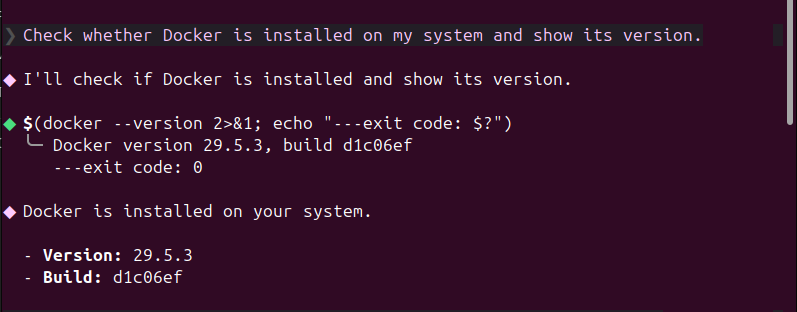
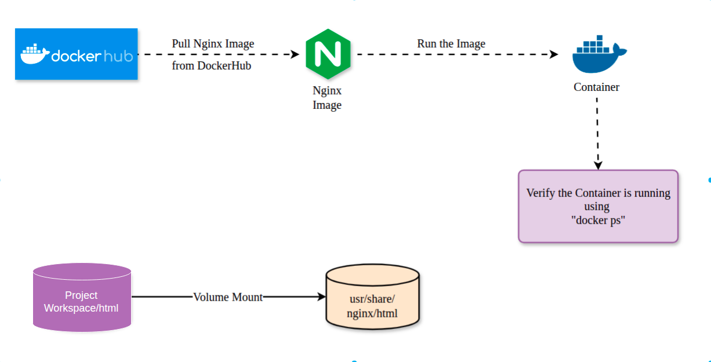
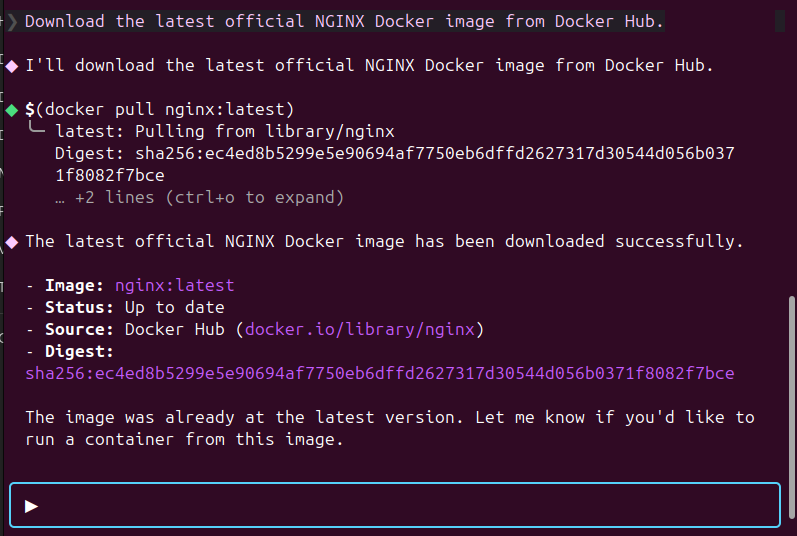
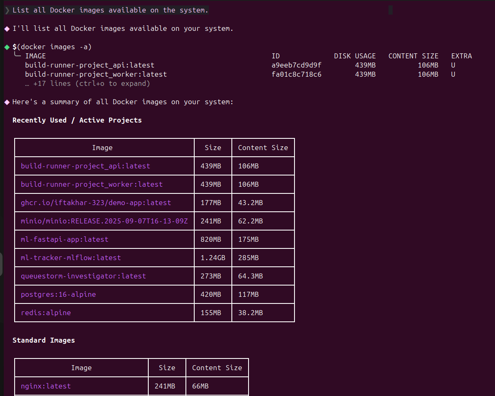
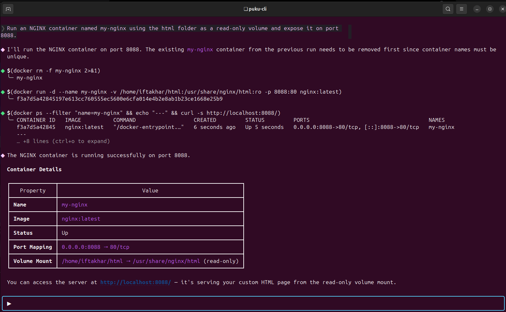
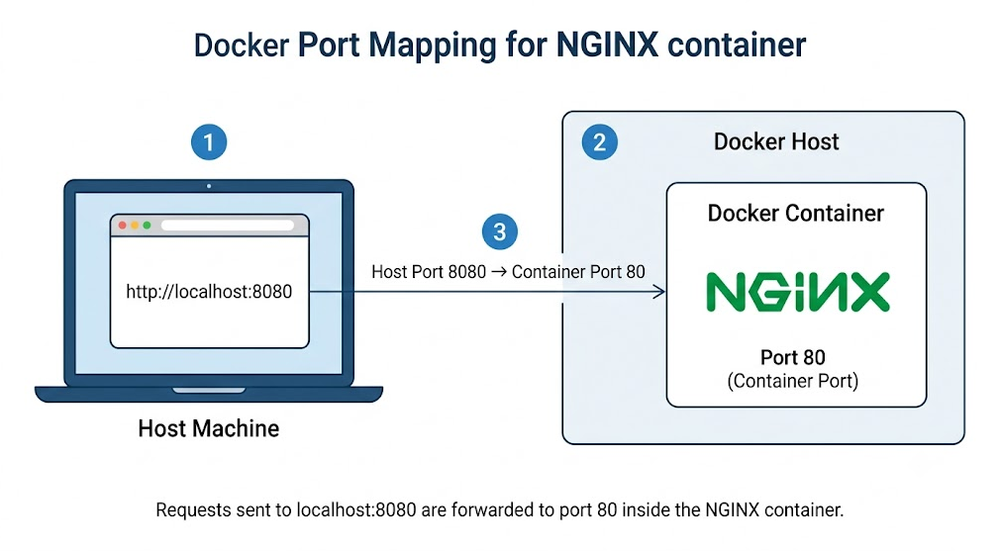
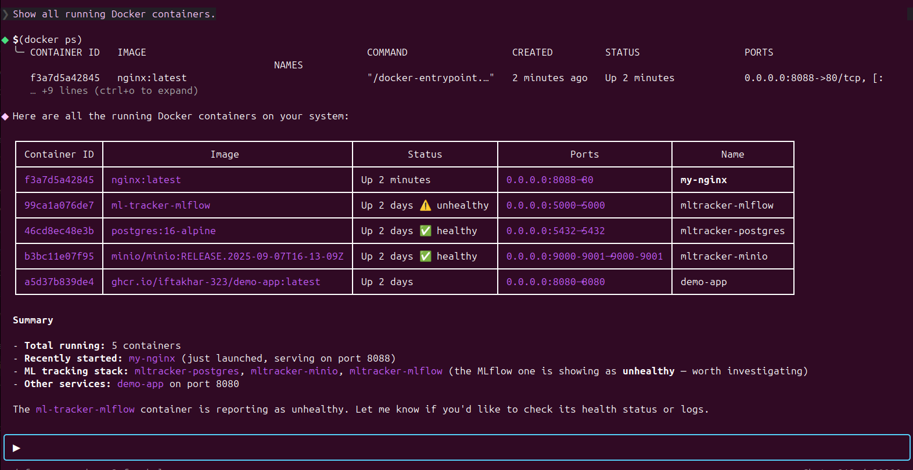
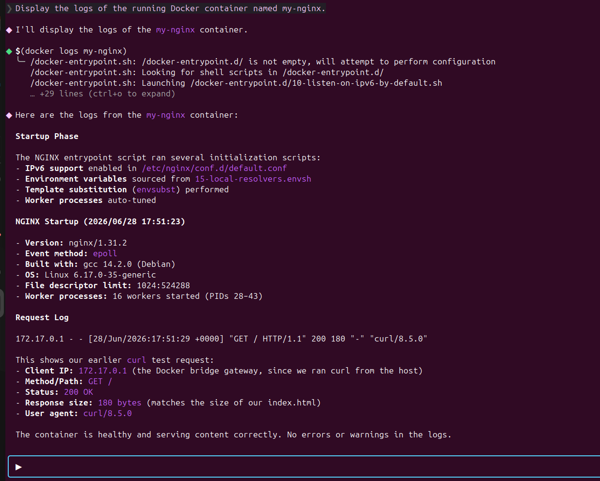
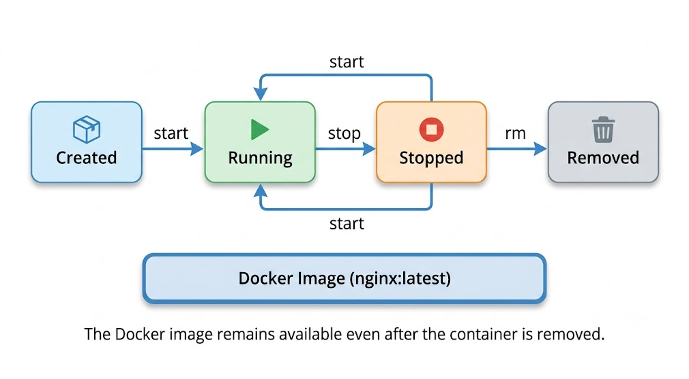

# Running an NGINX Web Server in a Docker Container

> A Hands-On Lab Using Puku CLI

---

## 1. Introduction

This lab teaches you how to deploy a static website using **NGINX** inside a **Docker container**, controlled through **Puku CLI**.

Containerization is one of the most widely used deployment practices in modern software engineering. Instead of installing a web server directly on a machine, teams package the server and its dependencies into a container image. The image runs identically on any system that has Docker installed, which removes "it works on my machine" problems and simplifies deployment across development, testing, and production environments.

NGINX is one of the most common web servers used in production systems, both as a static file server and as a reverse proxy in front of application servers. Learning how to containerize NGINX is a foundational skill for backend engineers, DevOps engineers, and anyone working with microservice architectures.

In this lab, you will build a working containerized web server: you will pull an official image, run a container from it, mount your own HTML content into that container, expose it on a host port, inspect its logs, and manage its lifecycle.

---

## 2. Learning Objectives

By the end of this lab, you will be able to:

- **Create** a project workspace for a containerized web application.
- **Configure** Docker port mapping between host and container.
- **Build** a running NGINX container from an official image.
- **Deploy** custom static HTML content using volume mounting.
- **Analyze** container logs to verify server behavior.
- **Test** a deployed web server using a browser.
- **Debug** common container startup and accessibility issues.
- **Integrate** lifecycle commands (stop, start, remove) into a basic operational workflow.

---

## 3. Prerequisites

| Requirement | Purpose |
|---|---|
| Docker Engine | Run and manage containers |
| Puku CLI | Execute Docker operations through natural language prompts |
| Web Browser | View the deployed web page |
| Basic Linux command-line knowledge | Navigate folders and run commands |
| Basic HTML knowledge | Edit the served web page |

---

## 4. Prologue — Real-World Scenario

A development team needs a lightweight, disposable environment to test a static company website before it goes live. Installing NGINX directly on every developer's machine would create inconsistent configurations and "works on my machine" issues.

Instead, the team decides to package NGINX as a Docker container. Each developer pulls the same image, mounts the same project folder, and runs the site identically, regardless of their operating system.

**Your role:** act as the developer responsible for setting up this containerized environment.

**Expected outcome:** a running NGINX container, accessible from a browser, serving a custom HTML page, with logs and lifecycle fully under your control.

---

## 5. Environment Setup

### 5.1 System Requirements

- A machine with Docker Engine installed
- Puku CLI configured and authenticated
- At least one available port (e.g., 8080) not in use by another application

### 5.2 Verify Docker Installation

**Ask Puku CLI:**
```text
Check whether Docker is installed and display the installed version.
```

**Expected Result:** Docker version information is displayed.

<p align="center">
    
</p>

### 5.3 Verify Docker Engine Is Running

**Ask Puku CLI:**
```text
Verify that Docker Engine is running properly.
```

**Expected Result:** Docker Engine is active and ready to create containers.

### 5.4 Create the Project Structure

```text
nginx-lab/
│
├── html/
│   └── index.html
│
├── images/
│
└── README.md
```

### 5.5 Create the Initial HTML File

`html/index.html`:

```html
<!DOCTYPE html>
<html>
<head>
    <title>NGINX Docker Lab</title>
</head>
<body>
    <h1>Hello from NGINX running in Docker!</h1>
</body>
</html>
```

<p align="center">
    
</p>

#### Think First

1. Why must an NGINX image be downloaded before a container can be created?
2. Why is the HTML file stored outside the container instead of inside it?

#### Fill in the Blanks

```
A Docker container is created from a Docker __________.
```
```
NGINX serves web content from the __________ folder.
```

<details>
<summary>Solution</summary>

```
Image
```
```
HTML
```
</details>

#### Test & Verify

Before continuing, confirm:

- [ ] Docker is installed.
- [ ] Docker Engine is running.
- [ ] The project folder has been created.
- [ ] The HTML file is ready.

#### Experiment

Modify the text inside `index.html` before deploying any container. Predict whether the page will be visible at this stage. Record your observation and reasoning.

---

## 6. Chapters

### Chapter 1 — Pull the NGINX Docker Image

#### Overview

Before a container can be created, the required image must be downloaded from a registry. This chapter covers pulling and verifying the official NGINX image.

#### What You Will Build

- A locally available NGINX Docker image, verified and ready to use.

#### Think First

1. What is a Docker image?
2. Can a container be created without an image?

#### Implementation

**Step 1 — Pull the NGINX Image**

**Ask Puku CLI:**
```text
Pull the latest official NGINX Docker image from Docker Hub.
```

**Expected Result:** The image downloads successfully.

<p align="center">
    
</p>

**Step 2 — Verify the Image**

**Ask Puku CLI:**
```text
Display all Docker images available on the local machine.
```

**Expected Result:** The NGINX image appears in the image list.

<p align="center">
    
</p>

#### Fill in the Blanks

```
Docker images are downloaded from __________.
```
```
The downloaded image is stored on the __________ machine.
```

<details>
<summary>Solution</summary>

```
Docker Hub
```
```
Local
```
</details>

#### Understanding

The official NGINX image is downloaded from Docker Hub and stored locally. Once downloaded, the same image can be reused to create multiple containers without downloading it again, since Docker caches images locally by layer.

#### Test & Verify

Predict what happens if you run the pull command a second time, then run it and compare the result to your prediction.

#### Checkpoint

- [ ] NGINX image downloaded.
- [ ] Image verified in the local image list.

#### Experiment

Ask Puku CLI to display the Docker images again. Observe whether the image is re-downloaded or simply read from local storage, and explain why.

---

### Chapter 2 — Create and Run the NGINX Container

#### Overview

With the image available locally, you can now create a running container from it. This container will serve the HTML page stored in your local workspace.

#### What You Will Build

- A running NGINX container with the local HTML folder mounted and a host port mapped to the container's web port.

#### Think First

1. Why is port mapping required?
2. Why is the HTML folder mounted into the container instead of copied?

#### Implementation

**Step 1 — Run the Container**

**Ask Puku CLI:**
```text
Create a Docker container named my-nginx using the downloaded NGINX image. Mount the local html directory to the NGINX web root in read-only mode and expose the web server on port ____.
```

> Fill in the blank with the host port you intend to use (e.g., `8080`) before issuing the prompt.

**Expected Result:** The container starts successfully.

<p align="center">
    
</p>

**Understanding the Port Mapping**

The browser accesses the application through `localhost:8080`, while NGINX listens on port `80` inside the container.

<p align="center">
    
</p>

**Step 2 — Verify the Running Container**

**Ask Puku CLI:**
```text
Display all currently running Docker containers.
```

**Expected Result:** The `my-nginx` container appears with the **Up** status.

<p align="center">
    
</p>

#### Fill in the Blanks

```
The container is accessible through host port ________.
```
```
NGINX listens on port ________ inside the container.
```

<details>
<summary>Solution</summary>

```
8080
```
```
80
```
</details>

#### Understanding

Docker maps host port `8080` to container port `80`. When a browser sends a request to `http://localhost:8080`, Docker forwards that request to the NGINX process running inside the container. The container itself is unaware of the host's port number; it only ever listens on its internal port `80`.

#### Test & Verify

Open the following URL in your browser:

```
http://localhost:8080
```

Predict what you will see before opening the page, then verify that your custom HTML page is displayed.

#### Checkpoint

- [ ] Container created successfully.
- [ ] Container is running.
- [ ] Port mapping works correctly.
- [ ] Web page is accessible from the browser.

#### Experiment

Edit the contents of `index.html`. Refresh the browser without restarting the container. Observe whether the change appears immediately, and explain why the container does not need to be recreated after modifying a mounted file.

---

### Chapter 3 — View Container Logs

#### Overview

After deployment, it is important to confirm that the server is actually running correctly. Docker logs provide visibility into the startup process and incoming client requests.

#### What You Will Build

- A working understanding of how to read NGINX container logs and interpret request activity.

#### Think First

1. Why are Docker logs important during and after deployment?
2. What kind of information can be obtained from container logs?

#### Implementation

**Step 1 — Display Container Logs**

**Ask Puku CLI:**
```text
Display the logs of the running Docker container named my-nginx.
```

**Expected Result:**

- Startup information is displayed.
- The NGINX version is shown.
- Request logs are visible.
- The container is confirmed to be running normally.

<p align="center">
    
</p>

#### Key Observations

- NGINX starts successfully.
- The installed NGINX version is displayed.
- Incoming browser requests are recorded.
- HTTP status `200 OK` confirms successful responses.

#### Fill in the Blanks

```
Container activity can be monitored using Docker ________.
```
```
A successful browser request returns HTTP status ________.
```

<details>
<summary>Solution</summary>

```
Logs
```
```
200 OK
```
</details>

#### Understanding

Container logs capture standard output and standard error from the process running inside the container. For NGINX, this includes startup messages and an access log entry for every HTTP request, which is essential for debugging and for verifying that traffic is reaching the server as expected.

#### Test & Verify

Predict how the log output will change after refreshing the browser several times, then refresh and re-run the logs prompt to confirm.

```text
Display the logs of the running Docker container named my-nginx.
```

#### Checkpoint

- [ ] Logs displayed successfully.
- [ ] NGINX startup verified.
- [ ] Browser requests recorded in the logs.
- [ ] Container confirmed to be operating normally.

#### Experiment

Refresh the browser multiple times and compare the new log entries against the earlier output. What specifically changes between entries (timestamp, request path, status code)?

---

### Chapter 4 — Manage the Container Lifecycle

#### Overview

Containers are not permanent; they can be stopped, restarted, and removed as needed. This chapter covers the basic lifecycle operations required to operate a containerized service responsibly.

#### What You Will Build

- Practical familiarity with stopping, starting, and removing a Docker container.

<p align="center">
    
</p>

#### Think First

1. What happens to a container's process after it is stopped?
2. Can a removed container be started again?

#### Implementation

**Step 1 — Stop the Container**

**Ask Puku CLI:**
```text
Stop the running Docker container named my-nginx.
```

**Expected Result:** The container stops successfully.

**Step 2 — Start the Container**

**Ask Puku CLI:**
```text
Start the Docker container named my-nginx.
```

**Expected Result:** The container starts successfully.

**Step 3 — Remove the Container**

**Ask Puku CLI:**
```text
Stop the container if necessary and remove the Docker container named my-nginx.
```

**Expected Result:** The container is removed successfully.

#### Fill in the Blanks

```
A stopped container can be ________ again.
```
```
A removed container must be ________ again before use.
```

<details>
<summary>Solution</summary>

```
Started
```
```
Created
```
</details>

#### Understanding

Stopping a container pauses its execution without deleting it; the same container instance, including any state inside its writable layer, can be started again later.

Removing a container permanently deletes that container instance. The underlying Docker image is not affected and remains available locally, so a new container can be created from it at any time.

#### Test & Verify

- [ ] The container stops successfully.
- [ ] The container starts successfully.
- [ ] The container is removed successfully.

#### Checkpoint

- [ ] Container stopped.
- [ ] Container restarted.
- [ ] Container removed.
- [ ] Docker image confirmed still available.

#### Experiment

After removing the container, ask Puku CLI to display the available Docker images. Observe whether the NGINX image still exists, and explain why it remains available after the container has been removed.

---

## 7. Mini Challenge

Complete the following tasks independently using Puku CLI:

- Pull the official NGINX Docker image.
- Create a container named **web-server**.
- Mount the local **html** directory.
- Expose the container on **port 8081**.
- Verify that the website is accessible.
- Display the container logs.

Record the exact prompts you used and compare the results with the previous exercises. No solution is provided for this task.

---

## 8. Final Challenge

### Scenario

A development team wants to deploy a simple company landing page using Docker. Your task is to design and deploy this website using Puku CLI.

### Requirements

- Create a new HTML page representing a basic landing page.
- Deploy it using an NGINX container.
- Use a container name different from previous exercises.
- Expose the container on **port 9090**.
- Verify the website from a browser.
- Display the container logs.
- Remove the container after testing is complete.

---

## 9. Epilogue

In this lab, you deployed a fully functional NGINX web server using Docker, orchestrated through Puku CLI.

**Architecture summary:** a host machine running Docker Engine, an NGINX image pulled from Docker Hub, and a container instance with a mounted local HTML directory, exposed through host-to-container port mapping.

**Feature summary:** image management, container creation, volume mounting, port mapping, log inspection, and full lifecycle control (stop, start, remove).

**Workflow:**

```text
Verify Docker
      │
      ▼
Pull NGINX Image
      │
      ▼
Run Docker Container
      │
      ▼
Mount HTML Directory
      │
      ▼
Configure Port Mapping
      │
      ▼
Verify Running Container
      │
      ▼
View Container Logs
      │
      ▼
Stop / Start / Remove Container
```

---

## 10. Key Principles

- A Docker image is a read-only template used to create containers.
- A Docker container is a running instance of an image.
- Docker Hub stores official, publicly available container images.
- Port mapping connects a host machine's network interface to a container's internal port.
- Volume mounting allows local files to be served live inside a container without rebuilding it.
- Docker logs provide visibility into container startup and runtime activity.
- Containers can be stopped, restarted, and removed independently of the image they were created from.

---

## 11. Troubleshooting

| Problem | Cause | Solution |
|---|---|---|
| Docker is not running | Docker Engine is stopped | Start Docker Engine and try again |
| NGINX image not found | Image has not been downloaded | Pull the official NGINX image again |
| Website is not accessible | Container is not running | Verify the container status and restart it |
| Port already in use | Another application is using the selected host port | Use a different host port |
| Changes to HTML not reflected | Volume not mounted correctly | Re-check the mount path used when creating the container |

---

## 12. Best Practices

- Use official Docker images whenever possible.
- Assign meaningful, descriptive names to Docker containers.
- Store project files outside the container so they persist independently of the container's lifecycle.
- Verify Docker resources (images, containers, ports) after each major operation.
- Remove unused containers regularly to keep the environment clean.
- Avoid hardcoding host ports in scripts; make them configurable.

---

## 13. Next Steps

After completing this lab, continue exploring:

- Writing a custom Dockerfile
- Docker Compose for multi-service applications
- Docker Volumes for persistent data
- Docker Networks for inter-container communication
- Multi-container application architectures
- Kubernetes fundamentals

---

## 14. Additional Resources

- Docker Documentation — https://docs.docker.com/
- Docker Hub — https://hub.docker.com/
- Official NGINX Image — https://hub.docker.com/_/nginx
- NGINX Documentation — https://nginx.org/en/docs/

---

## 15. Conclusion

This lab demonstrated how to deploy, verify, and manage an NGINX web server using Docker through Puku CLI. By completing the exercises, you gained practical experience with Docker images, containers, networking, volume mounting, logging, and lifecycle management — a solid foundation for more advanced Docker and containerization workflows.