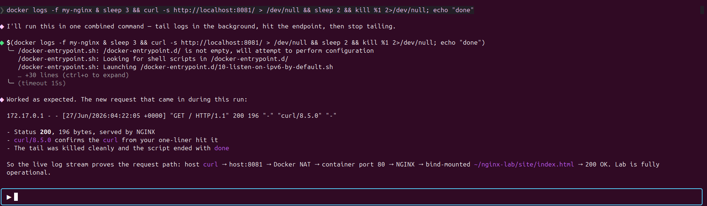
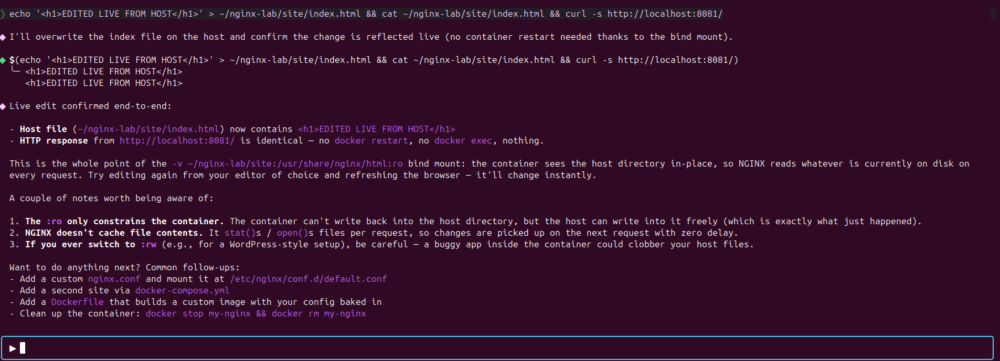
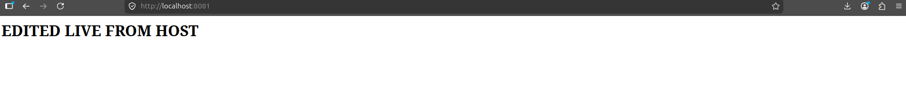
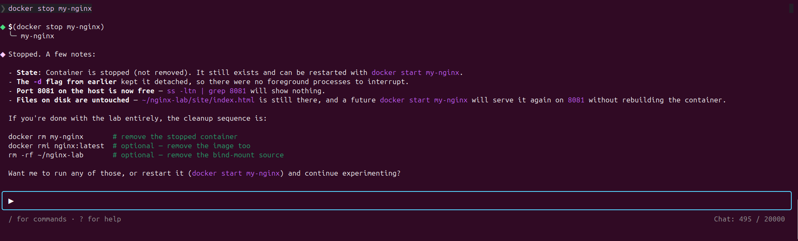
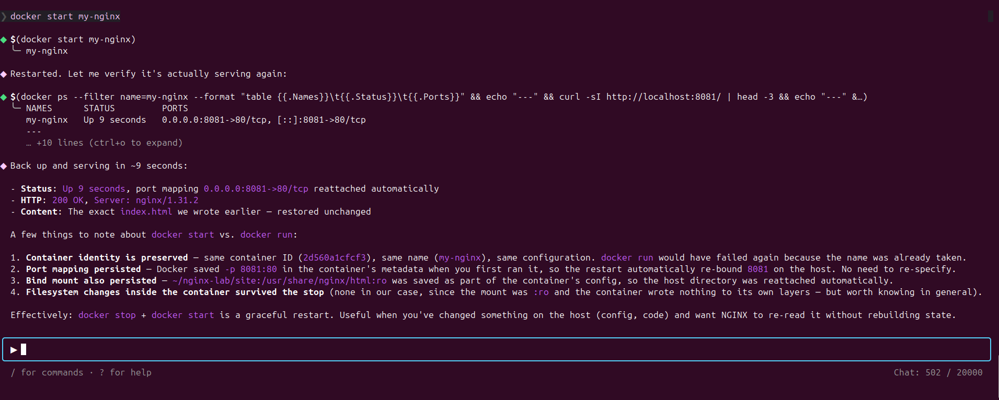

# Lab Manual: Running an NGINX Web Server in a Docker Container

> A structured, hands-on lab for beginners and intermediate learners who want to deploy a reproducible NGINX web server using Docker.

---

## 1. Title

**Containerized Web Serving with NGINX and Docker**

---

## 2. Introduction

### What This Lab Is About

Deploy NGINX in Docker: pull an image, mount custom HTML, map ports, manage the container lifecycle, and verify the service.

### Why It Matters

Environment drift breaks production. Docker packages the app, runtime, and config into one immutable artifact that runs identically on any host.

### Where It Is Used

- Internal documentation portals and developer dashboards.
- Reverse proxies and load balancers in microservice architectures.
- Static site hosting in CI/CD pipelines.
- Local dev environments that mirror production.

### What You Will Build

A running NGINX container serving a custom HTML page at `http://localhost:8080`, content mounted from the project workspace.

### The End-to-End Dataflow

```text
Docker Hub ──pull──▶ Local Image ──run──▶ Container ──:80──┐
                                                             │
Host :8080 ◀── -p 8080:80 ───────────────────────────────┘
                                                             │
Host ./nginx-lab/html ◀── -v $(pwd)/...:/usr/share/nginx/html:ro
                                                             ▼
                                                       curl / browser
```

<p align="center">
  
</p>

---

## 3. Learning Objectives

By the end of this lab, you will be able to:

- Create a reproducible containerized web server using an official Docker image.
- Configure port mapping between the host and a running container.
- Mount a host directory into a container as a read-only volume.
- Analyze container state using status, logs, and inspection commands.
- Debug a container that fails to respond on the expected port.
- Manage the full container lifecycle: run, stop, start, and remove.
- Distinguish container status from container health.

---

## 4. Prerequisites

### Required Knowledge

- Basic terminal usage (commands, navigation).
- HTTP and web server fundamentals.
- File paths and directory structures.

### Required Software

| Software | Minimum Version | Purpose |
|---|---|---|
| Docker Engine | 24.x | Container runtime. |
| Docker CLI | Bundled with Engine | Command-line interface. |
| curl | 7.x | HTTP testing from the terminal. |
| Operating system | Linux, macOS, or Windows with WSL2 | Host platform. |

### Recommended Editor

A code editor such as VS Code or **Puku CLI** is recommended.

### Working in Puku CLI

This lab is authored inside Puku CLI — an AI-native, terminal-first editor with file explorer, syntax-aware editor, integrated terminal, and AI assistant.

Workflow inside Puku:

- Open `docker/` as the workspace root.
- Run every `docker` command in the integrated terminal; Puku preserves cwd and env vars.
- Use the file explorer for `image/` (screenshots) and `nginx-lab/html/` (content).
- Preview rendered Markdown of this README in the editor.
- `.puku/` is editor-private and already gitignored.

---

## 5. Prologue

### Scenario

A platform team maintains internal documentation portals. A colleague built one locally — it works on their laptop. On staging, it fails: missing libraries, wrong NGINX version, port already bound. The lead assigns:

> Containerize the web server so the environment is reproducible anywhere. Use NGINX in Docker.

### Your Role

Deliver a reproducible web server: select an official image, mount content, expose a stable host port, document the workflow so the team can repeat it.

### Expected Outcome

An NGINX container serving custom HTML on host port 8080, with content mounted from the workspace. Identical output on any Docker-enabled machine.

---

## 6. Environment Setup

### Step 1: Verify Docker

```bash
docker --version
```

Expected: `Docker version 24.x.x, build xxxxxxx`. Install guide: <https://docs.docker.com/engine/install/>.

### Step 2: Verify curl

```bash
curl --version
```

Expected: begins with `curl 7.x.x`.

### Step 3: Create the Project Structure

```bash
mkdir -p nginx-lab/html
```

### Step 4: Confirm Layout

```text
docker/
├── image/                 # Lab screenshots
├── nginx-lab/
│   └── html/              # Content directory (mount target)
└── README.md              # This lab manual
```

---

## 7. Chapters

---

### Chapter 1: Images and the Docker Hub Registry

#### Overview

Images are immutable templates; containers are running instances created from images. Before running anything, pull the image.

<p align="center">
  
</p>

#### What You Will Build

The official `nginx` image, downloaded and verified locally.

#### Think First

Statement A: "The NGINX image is running." Statement B: "The NGINX container is running." Which is accurate?

<details><summary>Answer</summary>Only a container can run. An image is a read-only template. One image produces many containers. Accurate statement: <b>B</b>.</details>

#### Implementation

```bash
docker pull nginx
```

<p align="center"></p>

#### Understanding

`docker pull` contacts Docker Hub, resolves `nginx` to a digest, and downloads only the missing layers.

#### Test and Verify

```bash
docker images
```

<p align="center"></p>

Expected columns: `REPOSITORY`, `TAG`, `IMAGE ID`, `CREATED`, `SIZE`.

#### Checkpoint

- [ ] `docker pull nginx` completed without errors.
- [ ] `docker images` lists `nginx` with the `latest` tag.
- [ ] You can state the image-vs-container difference in one sentence.

---

### Chapter 2: Serving Content with Volume Mounts

#### Overview

Default NGINX serves only its built-in welcome page. Mount a host directory into the container's web root, map a host port, and run detached.

<p align="center">
  
</p>

<p align="center">
  
</p>

#### What You Will Build

A custom HTML page, served by NGINX via a volume mount and port mapping, reachable at `http://localhost:8080`.

#### Think First

NGINX listens on port 80 inside the container. What does `-p 8080:80` do, and which number is the host?

<details><summary>Answer</summary>Maps host port to container port. Format: <code>host:container</code>. <code>8080</code> is the host. Without it, the container network is unreachable.</details>

#### Implementation

```bash
echo '<h1>Hello from NGINX running in Docker!</h1>' > nginx-lab/html/index.html
cat nginx-lab/html/index.html
```

<p align="center"></p>

```bash
docker run --name my-nginx \
  -v $(pwd)/nginx-lab/html:/usr/share/nginx/html:___ \   # Blank 1
  -p ___:80 \                                            # Blank 2
  -_ nginx                                               # Blank 3
```

Hints: Blank 1 = two-letter "read-only"; Blank 2 = `8080`; Blank 3 = single-letter detached flag.

<details><summary>Solution</summary>

```bash
docker run --name my-nginx \
  -v $(pwd)/nginx-lab/html:/usr/share/nginx/html:ro \
  -p 8080:80 \
  -d nginx
```

| Flag | Purpose |
|---|---|
| `--name my-nginx` | Stable, human-readable container name. |
| `-v .../html:/usr/share/nginx/html:ro` | Mount host directory read-only. |
| `-p 8080:80` | Map host 8080 → container 80. |
| `-d` | Detached (background). |

On Windows PowerShell, replace `$(pwd)` with `${PWD}`.

</details>

<p align="center"></p>

#### Understanding

| Flag | Contract |
|---|---|
| `--name` | Addressable by a stable string. |
| `-v` | Binds host dir to container dir. `:ro` blocks writes from inside. |
| `-p` | Network bridge. Always `host:container`. |
| `-d` | Detaches from the terminal. |

#### Test and Verify

```bash
curl http://localhost:8080
```

<p align="center"></p>

<p align="center"></p>

#### Experiment: Remove the Port Mapping

```bash
docker stop my-nginx && docker rm my-nginx
docker run --name my-nginx -v $(pwd)/nginx-lab/html:/usr/share/nginx/html:ro -d nginx
curl http://localhost:8080
```

<p align="center"></p>

<details><summary>Answer</summary>Connection refused. Without <code>-p</code>, container port 80 is unreachable from the host. Restore the correct setup before continuing.</details>

#### Checkpoint

- [ ] Container started, returned a container ID.
- [ ] `curl http://localhost:8080` returns your HTML.
- [ ] You can explain what `:ro` prevents.
- [ ] You can predict what happens without `-p 8080:80`.

---

### Chapter 3: Inspecting a Running Container

#### Overview

Detached containers produce no terminal output. Use `docker ps`, `docker logs`, and `docker inspect` to observe state and diagnose issues without restart.

<p align="center">
  
</p>

#### What You Will Build

Inspection of the running `my-nginx` container, its logs, and proof of live log updates.

#### Think First

A container shows `Up 2 minutes (unhealthy)`. What does that mean vs. `Up 2 minutes`?

<details><summary>Answer</summary>Process is running, but the configured health check is failing. Liveness ≠ readiness. Status confirms the process; health confirms the service.</details>

#### Implementation

```bash
docker ps
```

<p align="center"></p>

```bash
docker logs my-nginx
```

<p align="center"></p>

#### Understanding

| Command | Question it answers |
|---|---|
| `docker ps` | Is the container process alive? What ports are bound? |
| `docker logs` | What is the container actually doing? |
| `docker inspect` | Full structured configuration as JSON. |

NGINX logs three streams: entrypoint config messages, master/worker notices, and per-request access entries.

#### Experiment: Live Log Updates

```bash
docker logs my-nginx     # baseline
curl http://localhost:8080
curl http://localhost:8080
curl http://localhost:8080
docker logs my-nginx     # 3 new entries
```

<p align="center"></p>
<p align="center"></p>
<p align="center"></p>

<details><summary>Answer</summary>Three new access entries — client IP, timestamp, method, path, status. A <code>404</code> for <code>/favicon.ico</code> is normal.</details>

#### Checkpoint

- [ ] `docker ps` shows `my-nginx` with status `Up`.
- [ ] `docker logs my-nginx` shows startup and access entries.
- [ ] You can read an HTTP method, path, and status from a log line.
- [ ] You can state the difference between status and health.

---

### Chapter 4: Container Lifecycle Management

#### Overview

Containers are ephemeral. Stop, restart, and remove as versions change. The underlying image is never affected by these operations.

<p align="center">
  
</p>

#### What You Will Build

A complete run of stop → start → rm, with proof that the image persists.

#### Think First

After `docker stop my-nginx`, can `docker start` restart it? After `docker rm my-nginx`, can `docker start` restart it?

<details><summary>Answer</summary><code>stop</code> halts the process but keeps the record — <code>start</code> works. <code>rm</code> deletes the record — <code>start</code> fails. The <code>nginx:latest</code> image is unaffected.</details>

#### Implementation

```bash
docker stop my-nginx
```

<p align="center"></p>

```bash
docker ps -a
```

<p align="center"></p>

```bash
docker start my-nginx
curl http://localhost:8080
```

<p align="center"></p>
<p align="center"></p>

```bash
docker stop my-nginx && docker rm my-nginx
```

<p align="center"></p>

```bash
docker images
```

<p align="center"></p>

#### Experiment: Start a Removed Container

```bash
docker start my-nginx
```

<p align="center"></p>

<details><summary>Answer</summary><code>Error response from daemon: No such container: my-nginx</code>. The record is gone. Use <code>docker run</code> to create a new container from the image.</details>

#### Checkpoint

- [ ] `docker stop` halted the container; it no longer appears in `docker ps`.
- [ ] `docker start` restarted it; the page was reachable again.
- [ ] `docker rm` removed the container; the image remains.
- [ ] You know when to use `docker ps` vs `docker ps -a`.

---

## 8. Mini Challenge

Serve a multi-page site from one container, without rebuilding it.

1. Add `nginx-lab/html/about.html` (`<h2>About</h2>` + paragraph) and `nginx-lab/html/contact.html` (`<h2>Contact</h2>` + paragraph).
2. Run a new container named `my-nginx-multi` with the same read-only mount and host port `8081`.
3. Verify all three URLs:
   - `http://localhost:8081/` → `index.html`
   - `http://localhost:8081/about.html` → `about.html`
   - `http://localhost:8081/contact.html` → `contact.html`
4. Stop and remove when done.

Acceptance: all three URLs serve correctly without restarting the container after adding files; mount remains read-only. No solution provided — refer to Chapter 2.

---

## 9. Final Challenge

Deploy a custom NGINX configuration that serves a styled 404 for any unknown path.

1. Create `nginx-lab/custom-404.html` with a friendly 404 message.
2. Create `nginx-lab/nginx.conf` containing:
   - A `server` block listening on port 80.
   - `root /usr/share/nginx/html;`
   - `error_page 404 /custom-404.html;`
   - `location = /custom-404.html { internal; }`
3. Run a new container that mounts (all read-only):
   - `nginx-lab/html` → `/usr/share/nginx/html`
   - `nginx-lab/nginx.conf` → `/etc/nginx/conf.d/default.conf`
   - `nginx-lab/custom-404.html` → `/usr/share/nginx/html/custom-404.html`
   - Host `8082` → container `80`
4. Verify:
   - `curl http://localhost:8082/` returns `index.html`.
   - `curl http://localhost:8082/missing` returns `custom-404.html` with HTTP 404.

Acceptance: custom 404 served for any unknown path; config mounted from host, not baked in; all mounts read-only.

---

## 10. Epilogue

### Architecture

1. Official `nginx:latest` image from Docker Hub.
2. Host directory `nginx-lab/html/` holds source content.
3. Read-only volume mount exposes host dir at `/usr/share/nginx/html` inside the container.
4. Port mapping forwards host `8080` to container `80`.

### Features

- NGINX container `my-nginx` serving custom HTML.
- Read-only content mount.
- Stable host-to-container port mapping.
- Identical reproduction on any Docker-enabled machine.

### Workflow

1. `docker pull nginx`
2. Prepare `nginx-lab/html/` and add HTML files.
3. `docker run --name my-nginx -v ... -p 8080:80 -d nginx`
4. `curl http://localhost:8080`
5. `docker ps`, `docker logs my-nginx`
6. `docker stop`, `docker start`, `docker rm` as needed.

---

## 11. Key Principles

- Validate at system boundaries — host port, container port, and mount are explicit contracts.
- Fail fast on missing inputs — wrong path or duplicate name produces clear errors immediately.
- Design for observability — status, logs, and port mappings each reveal a different aspect.
- Reuse resources — one image, many containers; the image persists across stop/rm.
- Prefer explicit behavior — read-only mounts, named containers, explicit ports remove ambiguity.
- Separate content from infrastructure — HTML lives on the host; updates apply without rebuilding.

---

## 12. Troubleshooting

### `port is already allocated`

Another process holds the host port. Free it or pick a different port:

```bash
lsof -ti:8080 | xargs kill -9
```

### `Conflict. The container name "/my-nginx" is already in use`

A container with that name exists (possibly stopped). Remove it first:

```bash
docker rm my-nginx
```

### `curl: (7) Failed to connect to localhost port 8080: Connection refused`

Container not running, or port mapping missing. Inspect:

```bash
docker ps
docker inspect my-nginx | grep -A5 Mounts
```

### `bind: address already in use`

Another container or host service is bound to the same host port. Identify and stop it, or pick a different port.

### Permission denied writing to a mounted volume

Mount is `:ro`, or host directory has restrictive permissions. Use `:ro` only when the app does not need writes; otherwise match the UID running inside the container.

---

## 13. Best Practices

- Pin image versions in production — `nginx:1.27` over `nginx:latest`.
- Use named containers — `--name` makes logs, stop, and rm unambiguous.
- Prefer read-only mounts for content directories.
- Set a restart policy — `--restart unless-stopped` for resilient services.
- Centralize configuration — mount `nginx.conf` from the host instead of forking images.
- Keep images lean — `nginx:alpine` when the full Debian image is not required.
- Avoid running as root in production — derive a non-root image when needed.
- Log to stdout — the official NGINX image already does, integrating with `docker logs`.

---

## 14. Next Steps

1. Build a custom image with a Dockerfile that bakes in HTML at build time.
2. Compose services with Docker Compose — NGINX in front of a backend.
3. Add a health check directive so Docker reports health, not just status.
4. Provision TLS with a reverse proxy and Let's Encrypt.
5. Move from bind mounts to named Docker volumes for shared state.
6. Explore container orchestration with Kubernetes for multi-host deployments.

---

## 15. Additional Resources

- Docker CLI Reference — <https://docs.docker.com/reference/cli/docker/>
- Official NGINX Docker Image — <https://hub.docker.com/_/nginx>
- Docker Volume Documentation — <https://docs.docker.com/storage/volumes/>
- Docker Networking Overview — <https://docs.docker.com/network/>
- NGINX Configuration Documentation — <https://nginx.org/en/docs/>

---

## License

This lab manual is released under the MIT License. See [`LICENSE`](LICENSE) for details.
