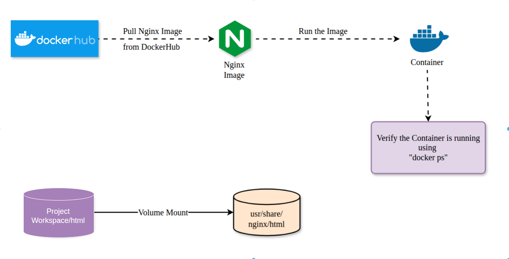
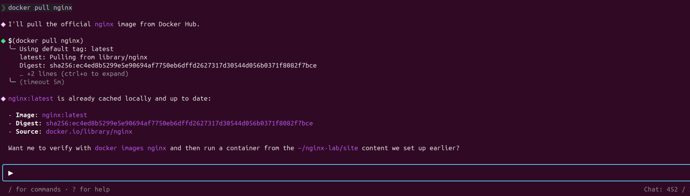
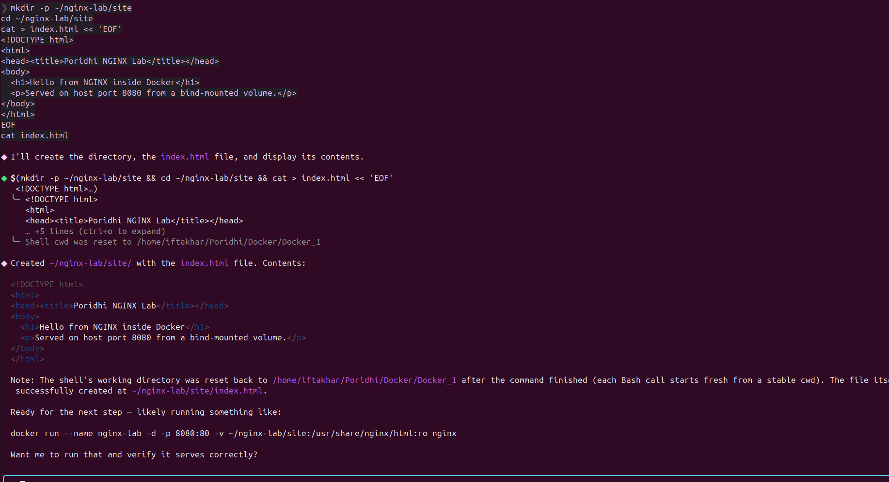
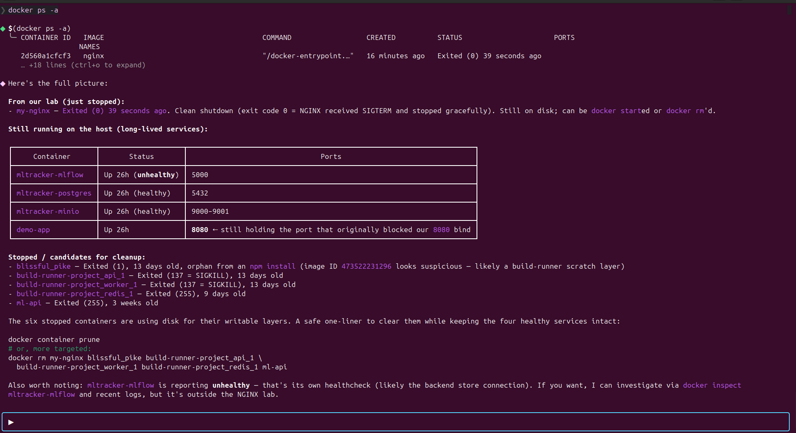

# Running an NGINX Web Server in a Docker Container

> A concise, image-driven Docker + NGINX lab. Pull the NGINX image, serve custom HTML, inspect a running container, and manage its lifecycle from the command line.

This lab is designed to be completed inside **Puku CLI** because Puku keeps the editor, integrated terminal, screenshots, and this manual in one workspace. Open the `docker/` folder in Puku, run every command below in its integrated terminal, and read this file in the Markdown preview while you work.

---

## 1. Title

**Running an NGINX Web Server in a Docker Container**

---

## 2. Introduction

### What This Lab Is About

This lab teaches how to deploy an NGINX web server inside a Docker container. It covers pulling official images from Docker Hub, mounting a custom HTML directory, mapping host ports, managing the container lifecycle, and verifying a running web service from the command line.

### Why This Topic Is Important

A common cause of production failures is environment drift — software that works on a developer's machine but fails on a shared server because of missing dependencies, version mismatches, or port conflicts. Docker eliminates this problem by packaging the application, its runtime, and its configuration into a single immutable artifact.

### Where It Is Used in Industry

- Internal documentation portals and developer dashboards.
- Reverse proxies and load balancers in microservice architectures.
- Static site hosting in CI/CD pipelines.
- Local development environments that mirror production.

### What You Will Build

A running NGINX container serving a custom HTML page at `http://localhost:8080`, with the content directory mounted from your project workspace. The same workflow will reproduce identically on any machine where Docker is installed.

---

## 3. Learning Objectives

By the end of this lab, you will be able to:

- Create a reproducible containerized web server using an official Docker image.
- Configure port mapping between the host and a running container.
- Mount a host directory into a container as a read-only volume.
- Analyze container state using status, logs, and inspection commands.
- Debug a container that fails to respond on the expected port.
- Manage the full container lifecycle: run, stop, start, and remove.
- Distinguish container status from container health.

---

## 4. Prerequisites

### Required Knowledge

- Basic terminal usage (running commands, navigating directories).
- Fundamental understanding of HTTP requests and web servers.
- Familiarity with file paths and directory structures.

### Required Software

| Software | Minimum Version | Purpose |
|---|---|---|
| Docker Engine | 24.x | Container runtime. |
| Docker CLI | Bundled with Engine | Command-line interface. |
| curl | 7.x | HTTP testing from the terminal. |
| Operating system | Linux, macOS, or Windows with WSL2 | Host platform. |

### Recommended Editor

A code editor with an integrated terminal is recommended. This lab assumes **Puku CLI**, which places the editor, terminal, screenshots, and this manual in one window.

#### Puku CLI quick reference

| Action in the lab | Where to do it in Puku |
|---|---|
| Edit `nginx-lab/html/index.html` | Editor (saves are picked up by the running container). |
| Run `docker pull`, `docker run`, `docker ps`, `docker logs` | Integrated Terminal (same `cwd`, same env vars). |
| Read this manual while working | Markdown preview of `README.md`, side-by-side with the terminal. |
| Open a referenced screenshot | File Explorer — `image/`. |
| Debug a failed `docker run` | AI Assistant — paste the error and ask for an explanation. |
| Commit and push to GitHub | Integrated Terminal — git is already wired to `docker_nginx`. |

The `.puku/` folder is created by Puku for its private state and is already in `.gitignore`, so it never reaches GitHub.

---

## 5. Prologue

### Scenario

You have joined a platform team that maintains a set of internal documentation portals. A colleague built one of these portals locally and it works on their laptop. When the service is deployed to a shared staging server, the application fails: missing system libraries, wrong NGINX version, and a port already bound by another service.

The infrastructure lead assigns you the following task:

> Containerize the web server so the environment is reproducible anywhere. Use NGINX in Docker.

### Your Role

You are the engineer responsible for delivering a working, reproducible web server. You must select an official base image, define how content is mounted, expose the service on a stable host port, and document the workflow so the rest of the team can repeat it.

### Expected Outcome

A running NGINX container that serves a custom HTML page, mapped to host port 8080, with its content directory mounted from the project workspace. The configuration must work identically when re-run on any Docker-enabled machine.

<p align="center"></p>

---

## 6. Environment Setup

### Step 1: Verify Docker Installation

```bash
docker --version
```

Expected output:

```text
Docker version 24.x.x, build xxxxxxx
```

If Docker is not installed, follow the official installation guide for your platform: <https://docs.docker.com/engine/install/>.

### Step 2: Verify curl

```bash
curl --version
```

Expected output begins with `curl 7.x.x`.

### Step 3: Create the Project Directory Structure

```bash
mkdir -p nginx-lab/html
```

This creates the workspace that will later hold the custom HTML content served by NGINX.

### Step 4: Confirm the Project Layout

```text
docker/
├── image/                 # Lab screenshots
├── nginx-lab/
│   └── html/              # Content directory (mount target)
└── README.md              # This lab manual
```

---

## 7. Chapters

---

### Chapter 1: Images and the Docker Hub Registry

#### Overview

Docker images are the immutable templates from which containers are created. Before you can run any container, you must have its image available locally. Docker Hub is the default public registry that hosts official, maintained images for common software, including NGINX.

#### What You Will Build

You will download the official `nginx` image from Docker Hub and confirm it is available on your local machine.

#### Think First

Consider the following two statements:

> Statement A: "The NGINX image is running."
> Statement B: "The NGINX container is running."

Which statement is technically accurate, and what is the difference between an image and a container?

<details>
<summary>Answer</summary>

Only a container can run. An image is a read-only template: a snapshot of a filesystem and configuration. A container is a running instance created from that image.

One image can produce many containers simultaneously, each isolated from the others.

The accurate statement is **Statement B: "The NGINX container is running."**
</details>

#### Implementation

Run the following command in your terminal:

```bash
docker pull nginx
```

Docker downloads each layer of the image in parallel and confirms each layer as it completes.

<p align="center"></p>

#### Understanding

The `docker pull` command performs two actions:

1. It contacts Docker Hub and resolves the image name `nginx` to a specific image digest.
2. It downloads only the layers that are not already present on the local machine, then assembles them into a single image.

#### Test and Verify

Confirm the image is available locally:

```bash
docker images
```

<p align="center"></p>

Predict: which columns will this command display?

<details>
<summary>Answer</summary>

The columns are `REPOSITORY`, `TAG`, `IMAGE ID`, `CREATED`, and `SIZE`. The `nginx` image with tag `latest` appears in the list.

```text
REPOSITORY   TAG       IMAGE ID       CREATED       SIZE
nginx        latest    ec4ed8b5299e   2 weeks ago   241MB
```
</details>

#### Checkpoint

- [ ] `docker pull nginx` completed without errors.
- [ ] `docker images` lists `nginx` with the `latest` tag.
- [ ] You can explain the difference between an image and a container in one sentence.

---

### Chapter 2: Serving Content with Volume Mounts

#### Overview

A container started from the default `nginx` image serves only its built-in welcome page. To serve custom content, you must mount a host directory into the container's web root. This chapter introduces volume mounts, port mapping, and detached execution — the three flags that make a container useful in practice.

<p align="center">
  
</p>

A volume mount binds a host directory to a path inside the container. Here, `./nginx-lab/html` is mounted at `/usr/share/nginx/html`. The `:ro` flag makes the mount read-only — NGINX reads your files, but cannot modify them. Edits on the host appear immediately in the served page, with no container restart.

#### What You Will Build

You will create a custom HTML file, run the NGINX container with a volume mount and port mapping, and verify that the server returns your custom content on `http://localhost:8080`.

#### Think First

The NGINX server inside the container listens on port 80. Your host machine cannot directly reach port 80 inside a running container.

What does the `-p 8080:80` flag accomplish, and which number refers to the host?

<details>
<summary>Answer</summary>

The `-p` flag maps a host port to a container port. The format is `host_port:container_port`.

`-p 8080:80` means requests arriving at port 8080 on your host are forwarded to port 80 inside the container. The first number (8080) is the host port.

Without this mapping, the container's network is isolated and unreachable from outside.
</details>

#### Implementation

Step 1: Create the HTML page.

```bash
echo '<h1>Hello from NGINX running in Docker!</h1>' > nginx-lab/html/index.html
```

Step 2: Verify the file contents.

```bash
cat nginx-lab/html/index.html
```

Step 3: Run the NGINX container with a volume mount and port mapping. Complete the blanks below.

```bash
docker run --name my-nginx \
  -v $(pwd)/nginx-lab/html:/usr/share/nginx/html:___ \   # Blank 1: read-only mode
  -p ___:80 \                                            # Blank 2: host port
  -_ nginx                                               # Blank 3: detached flag
```

Hints:

- Blank 1: two-letter abbreviation for "read-only".
- Blank 2: use port 8080 (a common choice).
- Blank 3: single-letter flag.

<details>
<summary>Solution</summary>

```bash
docker run --name my-nginx \
  -v $(pwd)/nginx-lab/html:/usr/share/nginx/html:ro \
  -p 8080:80 \
  -d nginx
```

| Flag | Purpose |
|---|---|
| `--name my-nginx` | Assigns a human-readable name to the container. |
| `-v .../html:/usr/share/nginx/html:ro` | Mounts the local directory into the container web root, read-only. |
| `-p 8080:80` | Maps host port 8080 to container port 80. |
| `-d` | Runs the container in detached (background) mode. |

On Windows PowerShell, replace `$(pwd)` with `${PWD}`.
</details>

<p align="center"></p>

#### Understanding

Each flag in the `docker run` command has a specific contract with the host system:

- `--name` makes the container addressable by a stable string instead of a random ID.
- `-v` binds a host directory to a directory inside the container. The `:ro` suffix enforces read-only access from inside the container, which prevents the web server from modifying your source files.
- `-p` declares the network bridge between host and container. The format is always `host:container`.
- `-d` detaches the container from the terminal so it runs in the background.

#### Test and Verify

Predict: what will the following command return?

```bash
curl http://localhost:8080
```

<p align="center"></p>

<details>
<summary>Expected output</summary>

```html
<h1>Hello from NGINX running in Docker!</h1>
```

The request reaches port 8080 on the host. The host forwards it to port 80 inside the container. NGINX reads `index.html` from the mounted volume and returns its contents.

The same result appears when visiting `http://localhost:8080` in a browser:

<p align="center"></p>
</details>

#### Experiment: Remove the Port Mapping

This experiment intentionally breaks the configuration to demonstrate why explicit port mapping is required.

Step 1: Stop and remove the current container.

```bash
docker stop my-nginx
docker rm my-nginx
```

Step 2: Start a new container without `-p 8080:80`.

```bash
docker run --name my-nginx \
  -v $(pwd)/nginx-lab/html:/usr/share/nginx/html:ro \
  -d nginx
```

Step 3: Attempt the same request.

```bash
curl http://localhost:8080
```

<p align="center"></p>

What happens, and why?

<details>
<summary>Answer</summary>

The request fails with `Connection refused`. Without `-p`, the container's port 80 is not reachable from the host. The container's network namespace is isolated by default, so the host cannot reach it.

Restore the correct setup before continuing:

```bash
docker stop my-nginx
docker rm my-nginx
```
</details>

#### Matching Exercise

Match each flag to its purpose.

| Flag | Purpose |
|---|---|
| `--name my-nginx` | A. Run detached. |
| `-v ...:ro` | B. Map host port to container port. |
| `-p 8080:80` | C. Mount a host directory read-only. |
| `-d` | D. Assign a name to the container. |

<details>
<summary>Answer</summary>

- `--name my-nginx` → D
- `-v ...:ro` → C
- `-p 8080:80` → B
- `-d` → A
</details>

#### Checkpoint

- [ ] Container started without errors and returned a container ID.
- [ ] `curl http://localhost:8080` returns your custom HTML.
- [ ] You can explain what `:ro` prevents and why it matters for web serving.
- [ ] You can predict what happens if `-p 8080:80` is omitted.

---

### Chapter 3: Inspecting a Running Container

#### Overview

A container running in detached mode produces no output in the terminal. To verify its state and diagnose issues without restarting it, Docker provides commands to inspect its status, examine its logs, and confirm its network configuration. This chapter introduces the observability tools that separate ad-hoc container use from production-grade container management.

<p align="center"></p>

#### What You Will Build

You will inspect the running `my-nginx` container, read its access logs, and observe how log entries appear in real time as requests arrive.

#### Think First

A teammate tells you a container shows status `Up 2 minutes (unhealthy)`. What does this indicate, and how does it differ from `Up 2 minutes`?

<details>
<summary>Answer</summary>

`Up 2 minutes` means the container process is running.
`Up 2 minutes (unhealthy)` means the process is running, but a configured health check is failing. The process has not crashed, but the service inside it is not passing its own readiness tests.

In production, a load balancer should route traffic only to healthy containers.
</details>

#### Implementation

Step 1: List running containers.

```bash
docker ps
```

<p align="center">80/tcp. This confirms the process is alive, the name is correct, and the port mapping is active."></p>

<details>
<summary>Expected output</summary>

```text
CONTAINER ID   IMAGE     COMMAND                  CREATED         STATUS    PORTS                  NAMES
8106ee13f2aa   nginx     "/docker-entrypoint…"   3 minutes ago   Up 3 minutes  0.0.0.0:8080->80/tcp   my-nginx
```

Verify in the output:

| Column | Expected value |
|---|---|
| `NAMES` | `my-nginx` |
| `STATUS` | `Up` |
| `PORTS` | `0.0.0.0:8080->80/tcp` |
</details>

Step 2: View container logs.

```bash
docker logs my-nginx
```

<p align="center"></p>

#### Understanding

`docker ps` answers the question *"Is the container process alive?"* by reporting its runtime state and bound ports.

`docker logs` answers the question *"What is the container actually doing?"* by streaming the contents of its stdout and stderr buffers. NGINX writes three categories of information to its logs:

1. Entrypoint configuration messages during startup.
2. Worker process notifications from the NGINX master.
3. Access log entries for every HTTP request, and error log entries for failed requests.

#### Test and Verify

Predict: what type of information will appear in NGINX logs?

<details>
<summary>Expected output (abbreviated)</summary>

```text
/docker-entrypoint.sh: Configuration complete; ready for start up
2026/06/25 08:47:19 [notice] 1#1: start worker processes
172.17.0.1 - - [25/Jun/2026:09:01:27 +0000] "GET / HTTP/1.1" 200 45 "-" "curl/7.81.0"
172.17.0.1 - - [25/Jun/2026:09:01:27 +0000] "GET /favicon.ico HTTP/1.1" 404 555 ...
```

A `404` entry for `/favicon.ico` is expected because browsers request this file automatically.
</details>

#### Experiment: Observing Live Log Updates

Step 1: Run `docker logs my-nginx` and note the current number of access log entries.

<p align="center"></p>

Step 2: In another terminal tab, run `curl http://localhost:8080` three times.

Step 3: Run `docker logs my-nginx` again.

What changed?

<details>
<summary>Answer</summary>

Three new access log entries appear, one per `curl` request. Each entry records the client IP, timestamp, HTTP method, path, and status code.
</details>

#### Think First

In a production system, why would you monitor these logs rather than only checking that the container is `Up`?

<details>
<summary>Answer</summary>

Container status confirms the process is running. Logs reveal what the process is actually doing.

A container can be `Up` while returning 500 errors on every request, rejecting authentication, or logging repeated connection failures to a database. Status checks confirm liveness. Logs reveal behavior.
</details>

#### Checkpoint

- [ ] `docker ps` shows `my-nginx` with status `Up`.
- [ ] `docker logs my-nginx` displays startup and access entries.
- [ ] You can identify the HTTP method, path, and status code in a log line.
- [ ] You can explain the difference between container status and container health.

---

### Chapter 4: Container Lifecycle Management

#### Overview

Containers are ephemeral by design. A deployment workflow involves starting, stopping, restarting, and eventually removing containers as application versions change. These operations leave the underlying image intact, which means a removed container can be replaced by creating a new one from the same image.

<p align="center"></p>

#### What You Will Build

You will stop, restart, and remove the `my-nginx` container, observe the state transitions at each step, and confirm that the underlying image is unaffected.

#### The Container Lifecycle

| Operation | Effect |
|---|---|
| `docker run` | Creates a new container from an image and starts it. |
| `docker stop` | Halts the container process. The container record is preserved. |
| `docker start` | Brings a stopped container back to running. Does not work after `docker rm`. |
| `docker rm` | Deletes the container record. The image is not affected. |

#### Think First

After `docker stop my-nginx`, can you run `docker start my-nginx`? After `docker rm my-nginx`, can you run `docker start my-nginx`?

<details>
<summary>Answer</summary>

`docker stop` halts the container process but preserves the container record. `docker start` can restart it.

`docker rm` deletes the container record entirely. `docker start` fails because the named container no longer exists.

The image (`nginx:latest`) is not affected by either operation.
</details>

#### Implementation

Step 1: Stop the container.

```bash
docker stop my-nginx
```

<p align="center"></p>

Predict: will `my-nginx` appear in `docker ps` output?

<details>
<summary>Answer</summary>

No. `docker ps` shows only running containers. To see all containers including stopped ones:

```bash
docker ps -a
```

```text
CONTAINER ID   IMAGE   COMMAND            CREATED         STATUS                     NAMES
8106ee13f2aa   nginx   "/docker-entry…"   10 minutes ago  Exited (0) 30 seconds ago  my-nginx
```

<p align="center"></p>
</details>

Step 2: Restart the container.

```bash
docker start my-nginx
curl http://localhost:8080
```

<p align="center"></p>

<details>
<summary>Expected output</summary>

```html
<h1>Hello from NGINX running in Docker!</h1>
```
</details>

Step 3: Stop and remove the container.

```bash
docker stop my-nginx
docker rm my-nginx
```

<p align="center"></p>

Step 4: Verify the image remains.

```bash
docker images
```

<p align="center"></p>

<details>
<summary>Expected output (image still present)</summary>

```text
REPOSITORY   TAG       IMAGE ID       CREATED       SIZE
nginx        latest    ec4ed8b5299e   2 weeks ago   241MB
```
</details>

#### Experiment: Start and Removed Container

Run:

```bash
docker start my-nginx && rm my-nginx
```

The first command fails because `docker rm` already deleted the container in Step 3. The `&&` never runs the second command.

<p align="center"></p>

What error do you see, and what does it tell you?

<details>
<summary>Answer</summary>

```text
Error response from daemon: No such container: my-nginx
```

The container record no longer exists. `docker start` cannot recreate it. To run NGINX again, you must use `docker run` to create a new container from the image.

This demonstrates that `docker rm` is irreversible and that images, not containers, are the durable artifact.
</details>

#### Checkpoint

- [ ] `docker stop` halted the container and it no longer appears in `docker ps`.
- [ ] `docker start` restarted it and the web page was accessible again.
- [ ] `docker rm` removed the container but the image remains in `docker images`.
- [ ] You can explain when `docker ps` versus `docker ps -a` is appropriate.

---

## 8. Mini Challenge

### Objective

Serve a multi-page HTML site from the same NGINX container without rebuilding it.

### Requirements

1. Create two additional files inside `nginx-lab/html/`:
   - `about.html` containing a single `<h2>About</h2>` heading and one paragraph.
   - `contact.html` containing a single `<h2>Contact</h2>` heading and one paragraph.
2. Start a new NGINX container named `my-nginx-multi` with:
   - The same volume mount as Chapter 2.
   - A different host port: `8081`.
3. Verify each page is reachable:
   - `http://localhost:8081/` → `index.html`
   - `http://localhost:8081/about.html` → `about.html`
   - `http://localhost:8081/contact.html` → `contact.html`
4. Stop and remove the container when finished.

### Acceptance Criteria

- All three URLs return their respective HTML files without restarting the container after adding new files.
- The volume mount must remain read-only.
- No solution is provided. Refer to Chapter 2 for the relevant flags.

---

## 9. Final Challenge

### Objective

Deploy a custom NGINX configuration that serves a 404 page for any unknown path, while preserving the existing content mount.

### Background

A production web server must respond predictably when users request paths that do not exist. Instead of returning a bare 404, the server should return a styled HTML page that maintains brand consistency.

### Requirements

1. Create a file `nginx-lab/custom-404.html` containing a friendly 404 message.
2. Create a file `nginx-lab/nginx.conf` with:
   - A `server` block listening on port 80.
   - A `root /usr/share/nginx/html;` directive.
   - An `error_page 404 /custom-404.html;` directive.
   - A `location = /custom-404.html { internal; }` directive to prevent direct access to the 404 page.
3. Run a new NGINX container that mounts both:
   - `nginx-lab/html` to `/usr/share/nginx/html` (read-only).
   - `nginx-lab/nginx.conf` to `/etc/nginx/conf.d/default.conf` (read-only).
   - `nginx-lab/custom-404.html` to `/usr/share/nginx/html/custom-404.html` (read-only).
   - Host port `8082` mapped to container port `80`.
4. Verify the behavior:
   - `curl http://localhost:8082/` returns `index.html`.
   - `curl http://localhost:8082/missing` returns the contents of `custom-404.html` with HTTP status 404.

### Acceptance Criteria

- The custom 404 page is returned for any unknown path.
- The configuration file is mounted from the host, not baked into the image.
- All volume mounts are read-only.

---

## 10. Epilogue

### Architecture Summary

The final system consists of four components working together:

1. The official `nginx:latest` image, sourced from Docker Hub.
2. A host directory `nginx-lab/html/` that holds the website's source content.
3. A Docker volume mount that exposes the host directory at `/usr/share/nginx/html` inside the container, in read-only mode.
4. A Docker port mapping that forwards host port 8080 to container port 80.

### Feature Summary

- A running NGINX container named `my-nginx` serving custom HTML content.
- Read-only content mount ensuring the web server cannot modify source files.
- Stable host-to-container port mapping allowing external access.
- Reproducible setup that runs identically on any Docker-enabled machine.

### Workflow Summary

1. Pull the official image: `docker pull nginx`.
2. Prepare the content directory: `mkdir -p nginx-lab/html` and add HTML files.
3. Run the container with volume mount, port mapping, and detached mode: `docker run --name my-nginx -v ... -p 8080:80 -d nginx`.
4. Verify the service: `curl http://localhost:8080`.
5. Inspect runtime state: `docker ps` and `docker logs my-nginx`.
6. Manage the lifecycle: `docker stop`, `docker start`, `docker rm`.

---

## 11. Key Principles

- Validate at system boundaries. The host port, container port, and volume mount are explicit contracts between host and container.
- Fail fast on missing inputs. A wrong path in `-v` or a duplicate container name produces immediate, clear errors.
- Design for observability. Status, logs, and port mappings each reveal a different aspect of container behavior.
- Reuse resources. One image produces many containers. Stop and remove containers freely; the image persists.
- Prefer explicit behavior over defaults. Read-only mounts, named containers, and explicit port mappings remove ambiguity.
- Separate content from infrastructure. The HTML directory lives on the host. Updates apply immediately, without rebuilding the container.

---

## 12. Troubleshooting

### Error: `port is already allocated`

| Field | Detail |
|---|---|
| Cause | Another process is using the specified host port. |
| Solution | Choose a different host port, or free the port: `lsof -ti:8080 \| xargs kill -9` |

### Error: `Conflict. The container name "/my-nginx" is already in use`

| Field | Detail |
|---|---|
| Cause | A container named `my-nginx` already exists (possibly stopped). |
| Solution | Remove the existing container first: `docker rm my-nginx` |

### Error: `curl: (7) Failed to connect to localhost port 8080: Connection refused`

| Field | Detail |
|---|---|
| Cause | The container is not running, or the port mapping does not match. |
| Solution | Inspect container state and port mapping: `docker ps`, `docker inspect my-nginx \| grep -A5 Mounts` |

### Error: `docker: Error response from daemon: bind: address already in use`

| Field | Detail |
|---|---|
| Cause | Another container or host service is bound to the same host port. |
| Solution | Identify and stop the conflicting process, or select a different host port. |

### Error: Permission denied when writing to a mounted volume

| Field | Detail |
|---|---|
| Cause | The mount is read-only (`:ro`) or the host directory has restrictive permissions. |
| Solution | Use `:ro` only when the application does not need write access. Otherwise, ensure the host directory is writable by the UID running inside the container. |

---

## 13. Best Practices

- Pin image versions in production. Use `nginx:1.27` instead of `nginx:latest` to ensure reproducible deployments.
- Use named containers. The `--name` flag makes logs, stop, and rm operations unambiguous.
- Prefer read-only mounts for content directories. Web servers do not need to modify HTML files at runtime.
- Set a restart policy. Use `--restart unless-stopped` for services that must recover from host reboots.
- Centralize configuration. Mount custom `nginx.conf` files from the host instead of building custom images for every configuration change.
- Keep images lean. Use the official `nginx:alpine` variant for smaller image size when the full Debian-based image is not required.
- Avoid running containers as root in production. Add a non-root user to a derived image when security requirements demand it.
- Log to stdout. The official NGINX image is already configured to write logs to stdout and stderr, which integrates with `docker logs`.

---

## 14. Next Steps

1. Build a custom image with a Dockerfile that includes the HTML at build time rather than via a runtime mount.
2. Compose multiple services using Docker Compose — for example, NGINX in front of a backend application.
3. Add a health check directive in a custom `nginx.conf` so Docker can report container health, not just process status.
4. Provision TLS certificates using a reverse proxy with Let's Encrypt.
5. Move from bind mounts to named Docker volumes for stateful data and shared storage across containers.
6. Explore container orchestration with Kubernetes for multi-host deployments.

---

## 15. Additional Resources

- Docker CLI Reference — <https://docs.docker.com/reference/cli/docker/>
- Official NGINX Docker Image — <https://hub.docker.com/_/nginx>
- Docker Volume Documentation — <https://docs.docker.com/storage/volumes/>
- Docker Networking Overview — <https://docs.docker.com/network/>
- NGINX Configuration Documentation — <https://nginx.org/en/docs/>

---

## License

This lab manual is released under the MIT License. See [`LICENSE`](LICENSE) for details.
