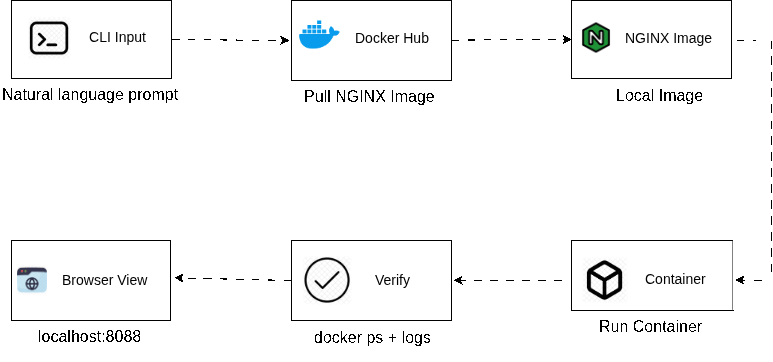

# Running an NGINX Web Server in a Docker Container

> A Hands-On Lab Using Puku CLI

---

## 1. Introduction

This lab is built around **Puku CLI** — you will not type raw Docker commands yourself. Instead, you will describe what you want in plain English, and Puku CLI will translate that into the correct Docker operation, run it, and show you the result. Your job is to understand *why* each operation happens, not just to copy commands.

The goal: deploy a static website using **NGINX** inside a **Docker container**, with everything driven through Puku CLI prompts — from pulling the image to managing the container's full lifecycle.

<p align="center">
    
</p>

The diagram above is the entire lab in one picture: pull the NGINX image from Docker Hub → run it as a container → verify it with `docker ps`, while your local `html` folder is mounted into the container at `/usr/share/nginx/html`, NGINX's default web root.

---

## 2. Learning Objectives

By the end of this lab, you will be able to:

- **Pull and verify** a Docker image using Puku CLI.
- **Run** a container with port mapping and volume mounting.
- **Inspect** container status and logs.
- **Manage** the container lifecycle (stop, start, remove).

---

## 3. Prerequisites

| Requirement | Purpose |
|---|---|
| Docker Engine | Run containers |
| Puku CLI | Execute Docker operations via natural-language prompts |
| Web Browser | View the deployed page |

---

## 4. Scenario

A team wants to test a static website without installing NGINX on every machine. Instead, they containerize it: same image, same prompts, same result on any machine. **Your role:** set this up using Puku CLI, end to end.

---

## 5. Environment Setup

**Project structure:**

```text
nginx-lab/
├── html/
│   └── index.html
└── images/
```

**`html/index.html`:**

```html
<!DOCTYPE html>
<html>
<head><title>NGINX Docker Lab</title></head>
<body><h1>Hello from NGINX running in Docker!</h1></body>
</html>
```

**Ask Puku CLI:**
```text
Check whether Docker is installed and display the installed version.
```

<p align="center">
    
</p>

**Ask Puku CLI:**
```text
Verify that Docker Engine is running properly.
```

#### Checkpoint
- [ ] Docker installed and Engine running.
- [ ] Project folder and `index.html` ready.

---

## 6. Chapters

### Chapter 1 — Pull the NGINX Image

**Think First:** What is a Docker image? Can a container exist without one?

**Ask Puku CLI:**
```text
Pull the latest official NGINX Docker image from Docker Hub.
```

<p align="center">
    
</p>

**Ask Puku CLI:**
```text
Display all Docker images available on the local machine.
```

<p align="center">
    
</p>

**Fill in the Blanks**
```
Docker images are downloaded from __________.
```
```
The downloaded image is stored on the __________ machine.
```
<details><summary>Solution</summary>

```
Docker Hub
```
```
Local
```
</details>

**Understanding:** Once pulled, the image is cached locally — it won't be re-downloaded for future containers.

**Checkpoint**
- [ ] Image pulled.
- [ ] Image verified in local list.

**Experiment:** Ask Puku CLI to list images again — is it re-downloaded, or read from cache?

---

### Chapter 2 — Run the NGINX Container

**Think First:** Why is port mapping needed? Why mount the HTML folder instead of copying it in?

**Ask Puku CLI:**
```text
Create a Docker container named my-nginx using the downloaded NGINX image. Mount the local html directory to the NGINX web root in read-only mode and expose the web server on port ____.
```
> Fill in the blank with your chosen host port (e.g., `8080`).

<p align="center">
    
</p>

<p align="center">
    
</p>

**Ask Puku CLI:**
```text
Display all currently running Docker containers.
```

<p align="center">
    
</p>

**Fill in the Blanks**
```
The container is accessible through host port ________.
```
```
NGINX listens on port ________ inside the container.
```
<details><summary>Solution</summary>

```
8080
```
```
80
```
</details>

**Understanding:** Docker forwards `localhost:8080` → container port `80`. The container itself only ever knows about port `80`.

**Test & Verify:** Open `http://localhost:8080`. Predict the page content before opening it, then confirm.

**Checkpoint**
- [ ] Container running.
- [ ] Page accessible from the browser.

**Experiment:** Edit `index.html`, refresh the browser without restarting the container. Why does it update instantly?

---

### Chapter 3 — View Container Logs

**Think First:** Why are logs useful here?

**Ask Puku CLI:**
```text
Display the logs of the running Docker container named my-nginx.
```

<p align="center">
    
</p>

**Fill in the Blanks**
```
Container activity can be monitored using Docker ________.
```
```
A successful browser request returns HTTP status ________.
```
<details><summary>Solution</summary>

```
Logs
```
```
200 OK
```
</details>

**Understanding:** Every browser request to the container shows up here — startup info plus a live access log.

**Checkpoint**
- [ ] Logs displayed and understood.

**Experiment:** Refresh the browser a few times, re-check the logs. What changed?

---

### Chapter 4 — Manage the Container Lifecycle

<p align="center">
    
</p>

**Think First:** What happens after a container is stopped? Can a removed container come back?

**Ask Puku CLI** (one prompt at a time):
```text
Stop the running Docker container named my-nginx.
```
```text
Start the Docker container named my-nginx.
```
```text
Stop the container if necessary and remove the Docker container named my-nginx.
```

**Fill in the Blanks**
```
A stopped container can be ________ again.
```
```
A removed container must be ________ again before use.
```
<details><summary>Solution</summary>

```
Started
```
```
Created
```
</details>

**Understanding:** Stopping pauses the container; removing deletes it permanently — but the image stays, so a new container can always be created from it.

**Checkpoint**
- [ ] Stop / Start / Remove all completed.
- [ ] Image confirmed still available after removal.

**Experiment:** After removing the container, list the images again. Still there? Why?

---

## 7. Mini Challenge

Using Puku CLI, independently:
- Pull the NGINX image.
- Create a container **web-server** on **port 8081**, with the `html` folder mounted.
- Verify it's accessible, then check its logs.

*No solution provided — compare your prompts with a classmate's.*

---

## 8. Final Challenge

Build a simple company landing page, deploy it via NGINX on a **new container name**, **port 9090**. Verify in the browser, check logs, then remove the container.

---

## 9. Epilogue & Key Principles

You used Puku CLI to pull an image, run a container with port mapping and a mounted volume, inspect logs, and control the full container lifecycle.

```text
Verify Docker → Pull Image → Run Container → Mount HTML →
Map Port → Verify → View Logs → Stop / Start / Remove
```

- An **image** is a template; a **container** is a running instance of it.
- **Port mapping** connects host ↔ container; **volume mounting** connects host files ↔ container files, live.
- Removing a container never removes the image.

---

## 10. Troubleshooting

| Problem | Cause | Solution |
|---|---|---|
| Docker not running | Engine stopped | Start Docker Engine |
| Image not found | Not pulled yet | Pull the NGINX image again |
| Site not accessible | Container not running | Check status, restart it |
| Port already in use | Another app holds the port | Choose a different host port |
| HTML changes not visible | Mount path wrong | Recheck the mount path used at creation |

---

## 11. Best Practices

- Use official images. Name containers meaningfully. Keep project files outside the container. Remove unused containers regularly.

---

## 12. Next Steps & Resources

**Next:** Dockerfile · Docker Compose · Docker Volumes · Docker Networks · Kubernetes basics

**Resources:**
- Docker Docs — https://docs.docker.com/
- Docker Hub — https://hub.docker.com/
- NGINX Official Image — https://hub.docker.com/_/nginx