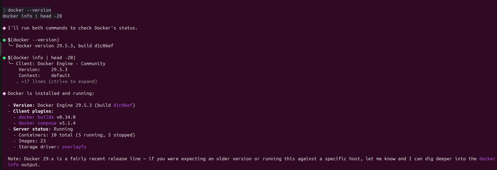
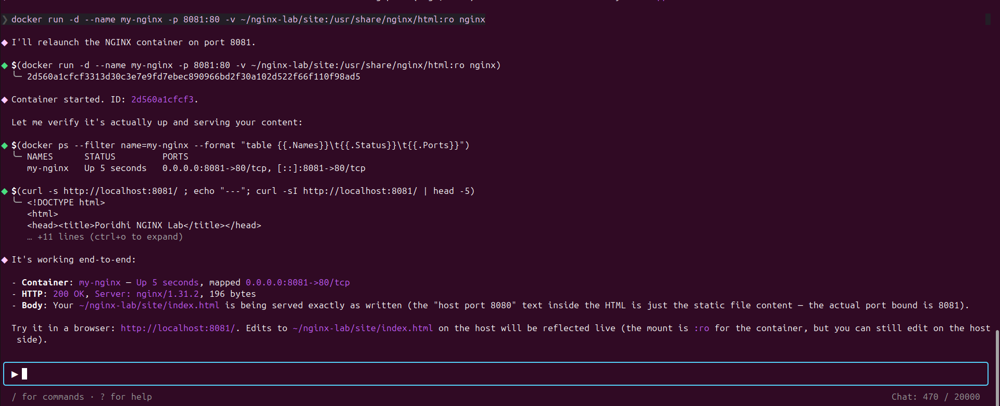

# Running an NGINX Web Server in a Docker Container

> A Beginner-Friendly Docker + NGINX Lab Manual

---

## Introduction

Docker is one of the most popular containerization platforms used to package and deploy applications consistently across different environments. Instead of installing software directly on the operating system, Docker runs applications inside isolated containers.

In this lab, you will deploy an **NGINX Web Server** inside a Docker container, serve a custom HTML page, inspect container information, and manage the complete container lifecycle using Docker CLI.

This lab is designed for beginners and follows a hands-on learning approach.

---

## Why Learn Docker?

Docker solves the common problem of **"It works on my machine."**

It provides:

- Consistent development environments
- Easy application deployment
- Lightweight virtualization
- Faster software delivery
- Better resource utilization
- Simplified DevOps workflow

Today Docker is widely used in Cloud Computing, DevOps, Software Engineering, Backend Development, and Microservice Architecture.

---

## What You Will Build

At the end of this lab you will build a complete Dockerized NGINX web server capable of:

- Pulling Docker images
- Running Docker containers
- Serving custom HTML pages
- Mapping container ports
- Mounting local directories
- Inspecting running containers
- Viewing container logs
- Managing the container lifecycle

<p align="center">
    
</p>

---

# Learning Objectives

After completing this lab, you will be able to:

- Pull Docker images from Docker Hub.
- Create and run Docker containers.
- Configure Docker port mapping.
- Mount host directories into containers.
- Inspect running containers.
- Analyze Docker logs.
- Start, stop, restart, pause, and remove containers.
- Troubleshoot common Docker problems.

---

# Prerequisites

Before starting this lab, make sure you have the following.

## Required Knowledge

- Basic Linux terminal commands
- Basic HTML
- Basic understanding of web servers

## Required Software

| Software | Purpose |
|-----------|----------|
| Docker Engine | Container Runtime |
| Docker CLI | Docker Commands |
| Puku CLI | Development Environment |
| Git | Version Control |
| VS Code (Optional) | Markdown Editing |

---

# Real-World Scenario

Imagine your company wants to deploy a lightweight internal documentation website.

Instead of installing NGINX separately on every computer, the DevOps team decides to package everything inside Docker.

Your responsibility is to deploy the website using an official Docker image so that every developer can run the exact same environment without configuration issues.

---

# Environment Setup

## Step 1 — Verify Docker Installation

Open the terminal and run:

```bash
docker --version
```

Expected Output

```text
Docker version 24.x.x
```

<p align="center">
    
</p>

---

## Step 2 — Verify Docker Engine

Run:

```bash
docker info
```

If Docker is installed correctly, Docker Engine information will appear.

---

## Step 3 — Create the Project Directory

```bash
mkdir -p nginx-lab/html
cd nginx-lab
```

---

## Step 4 — Project Structure

Your project should look like this.

```text
nginx-lab/
│
├── html/
│   └── index.html
│
├── image/
│   ├── docker_pull.png
│   ├── docker_image.png
│   ├── docker-run.png
│   ├── docker-ps.png
│   ├── docker-logs.png
│   └── ...
│
└── README.md
```

---

## Step 5 — Create the HTML Page

Create a file named **index.html** inside the **html** directory.

```html
<!DOCTYPE html>
<html>

<head>
    <title>Docker NGINX Lab</title>
</head>

<body>

<h1>Hello from Docker!</h1>

<p>This page is served by an NGINX container.</p>

</body>

</html>
```

---

# Think First

Before writing any Docker command, answer the following questions.

### Question 1

Can a Docker Image run by itself?

<details>
<summary>Show Answer</summary>

No.

A Docker Image is a read-only template.

Only a Docker Container can run.

</details>

---

### Question 2

Why do developers prefer Docker instead of installing software directly on the operating system?

<details>
<summary>Show Answer</summary>

Docker creates isolated environments that eliminate dependency conflicts and ensure applications run consistently across different machines.

</details>

---

# Environment Checklist

Before moving to the implementation section, verify the following.

- [ ] Docker is installed.
- [ ] Docker Engine is running.
- [ ] Project directory has been created.
- [ ] HTML file has been created.
- [ ] Project structure matches the diagram.

---

---

# Chapter 1 — Pulling the NGINX Image

## Overview

Before running a container, Docker must download its image. An image is a read-only template that contains everything needed to create a container.

NGINX is one of the most widely used web servers and its official image is available on Docker Hub.

---

## Objective

Download the official NGINX Docker image and verify that it exists locally.

---

## Implementation

Pull the image from Docker Hub.

```bash
docker pull nginx
```

<p align="center">

</p>

---

## Verify

List all downloaded images.

```bash
docker images
```

<p align="center">

</p>

Expected Output

```text
REPOSITORY   TAG       IMAGE ID       CREATED      SIZE
nginx        latest    xxxxxxxxx      xx days ago  xxxMB
```

---

## Understanding

- `docker pull` downloads an image.
- Images are stored locally.
- One image can create multiple containers.

---

## Think First

Can multiple containers be created from one image?

<details>
<summary>Answer</summary>

Yes.

One Docker image can create any number of independent containers.

</details>

---

## Checkpoint

- [ ] nginx image downloaded
- [ ] docker images lists nginx
- [ ] No errors occurred

---

# Chapter 2 — Running an NGINX Container

## Overview

A Docker container is a running instance of an image.

In this chapter you will create your first NGINX container and make it accessible from your browser.

---

## Objective

Run NGINX inside Docker.

---

## Implementation

```bash
docker run --name my-nginx \
-v $(pwd)/html:/usr/share/nginx/html:ro \
-p 8080:80 \
-d nginx
```

<p align="center">

</p>

---

## Command Explanation

| Option | Description |
|---------|-------------|
| --name | Assign container name |
| -v | Mount local folder |
| :ro | Read-only volume |
| -p | Port Mapping |
| -d | Detached mode |

---

## Understanding Port Mapping

The container listens on **port 80**, while your computer accesses it using **port 8080**.

```
Browser
   │
localhost:8080
   │
Docker
   │
Container Port 80
```

<p align="center">

</p>

---

## Verify

Visit

```
http://localhost:8080
```

or

```bash
curl http://localhost:8080
```

Expected Output

```html
<h1>Hello from Docker!</h1>
```

---

## Think First

What happens if you remove the `-p 8080:80` option?

<details>
<summary>Answer</summary>

The container still runs, but the web server cannot be accessed from the host machine.

</details>

---

## Checkpoint

- [ ] Container started
- [ ] Browser opens localhost:8080
- [ ] HTML page is displayed

---

# Chapter 3 — Inspecting the Running Container

## Overview

Docker provides several commands to inspect running containers.

These commands help monitor container status and troubleshoot problems.

---

## List Running Containers

```bash
docker ps
```

<p align="center">

</p>

Expected Output

```text
STATUS    Up
PORTS     8080->80
NAME      my-nginx
```

---

## View Container Logs

```bash
docker logs my-nginx
```

<p align="center">

</p>

The logs show:

- Server startup
- Requests
- Errors
- HTTP responses

---

## Think First

What is the difference between **docker ps** and **docker logs**?

<details>
<summary>Answer</summary>

docker ps shows whether the container is running.

docker logs shows what the application inside the container is doing.

</details>

---


# Chapter 4 — Container Lifecycle

## Overview

Containers can be started, stopped, restarted, paused, and removed whenever necessary.

The Docker image remains unchanged throughout these operations.

---

## Stop Container

```bash
docker stop my-nginx
```

<p align="center">

</p>

---

## Start Container Again

```bash
docker start my-nginx
```

---

## Pause the Container

```bash
docker pause my-nginx
```

---

## Resume the Container

```bash
docker unpause my-nginx
```

---

## Remove the Container

```bash
docker stop my-nginx

docker rm my-nginx
```

---

<p align="center">

</p>

---

## Lifecycle Summary

| Command | Purpose |
|----------|---------|
| docker run | Create & Start |
| docker stop | Stop |
| docker start | Restart |
| docker pause | Pause Execution |
| docker unpause | Resume |
| docker rm | Remove Container |

---

## Think First

After removing a container, can you start it again using `docker start`?

<details>
<summary>Answer</summary>

No.

After removal, the container no longer exists.

A new container must be created using `docker run`.

</details>

---

## Practical Exercise

Perform the following tasks:

- Pull the nginx image.
- Create a container named **my-nginx**.
- Open it in your browser.
- Stop the container.
- Restart it.
- Remove it.

Verify each step using Docker commands.

---
---

# Mini Challenge

Now that you understand the Docker basics, complete the following challenge without looking at the previous commands.

## Objective

Deploy a multi-page website using a single NGINX container.

---

## Requirements

Create the following files inside the **html** directory.

```
html/
│
├── index.html
├── about.html
└── contact.html
```

Run an NGINX container that:

- Uses the same mounted volume
- Uses host port **8081**
- Serves all three pages successfully

Verify the following URLs.

```
http://localhost:8081/

http://localhost:8081/about.html

http://localhost:8081/contact.html
```

---

## Self Assessment

Before continuing, verify the following.

- [ ] All pages are accessible.
- [ ] No container restart was required after editing HTML.
- [ ] The container is running correctly.
- [ ] Port mapping is correct.

---

# Final Challenge

## Objective

Customize the NGINX configuration and display a custom **404 Error Page**.

### Requirements

Create the following files.

```
nginx-lab/

│
├── html/
│
├── custom-404.html
│
└── nginx.conf
```

Your configuration should:

- Listen on port 80
- Serve files from `/usr/share/nginx/html`
- Display `custom-404.html` for missing pages

Run the container and verify:

```
http://localhost:8082
```

and

```
http://localhost:8082/unknown-page
```

The second URL should display your custom 404 page.

---

# Troubleshooting

## Error 1

### Port Already Allocated

```
docker: Error response from daemon:
bind: address already in use
```

### Cause

Another application is already using the selected port.

### Solution

Use another port.

Example

```bash
docker run -p 8081:80 nginx
```

---

## Error 2

### Container Name Already Exists

```
Conflict.
The container name "/my-nginx" is already in use.
```

### Cause

A container with the same name already exists.

### Solution

Remove the existing container.

```bash
docker rm my-nginx
```

---

## Error 3

### Connection Refused

```
curl: (7)
Failed to connect to localhost
```

### Cause

- Container is stopped.
- Wrong port mapping.
- Docker Engine is not running.

### Solution

```bash
docker ps

docker start my-nginx
```

---

## Error 4

### Image Not Found

```
Unable to find image
```

### Cause

The image has not been downloaded.

### Solution

```bash
docker pull nginx
```

---

# Best Practices

Follow these best practices when working with Docker.

- Always use official Docker images.
- Give containers meaningful names.
- Use read-only volumes whenever possible.
- Avoid using the `latest` tag in production.
- Remove unused containers regularly.
- Keep Docker images updated.
- Store application data outside the container.
- Use Git to version your project files.

---

# Key Concepts Learned

Throughout this lab you learned the following concepts.

| Concept | Description |
|----------|-------------|
| Docker Image | Read-only application template |
| Docker Container | Running instance of an image |
| Docker Hub | Public image repository |
| Volume Mount | Share files between host and container |
| Port Mapping | Connect host and container ports |
| Docker Logs | View container output |
| Container Lifecycle | Start, Stop, Pause, Remove |

---

# Workflow Summary

The complete workflow followed in this lab is shown below.

```text
Docker Hub
      │
      ▼
docker pull nginx
      │
      ▼
Docker Image
      │
      ▼
docker run
      │
      ▼
NGINX Container
      │
      ▼
Port Mapping (8080 → 80)
      │
      ▼
Browser Access
      │
      ▼
docker ps
docker logs
      │
      ▼
docker stop
docker start
docker rm
```

---

# Lab Summary

In this lab you successfully:

- Installed and verified Docker.
- Downloaded the official NGINX image.
- Created a Docker container.
- Mounted a local HTML directory.
- Configured port mapping.
- Accessed the web server from a browser.
- Inspected running containers.
- Viewed container logs.
- Managed the container lifecycle.
- Practiced Docker troubleshooting.

This workflow represents the foundation of container-based application deployment and is widely used in modern software development and DevOps environments.

---

# Next Steps

After completing this lab, continue learning the following topics.

1. Writing Dockerfiles
2. Docker Compose
3. Docker Networks
4. Docker Volumes
5. Multi-Container Applications
6. Docker Hub Publishing
7. Kubernetes Fundamentals

---

# Additional Resources

- Docker Documentation  
  https://docs.docker.com/

- Docker CLI Reference  
  https://docs.docker.com/reference/cli/docker/

- Docker Hub  
  https://hub.docker.com/

- Official NGINX Image  
  https://hub.docker.com/_/nginx

- NGINX Documentation  
  https://nginx.org/en/docs/

---

# Conclusion

This lab demonstrated how Docker simplifies web server deployment by running NGINX inside an isolated container. You learned how to download images, create containers, configure networking, mount local files, inspect container status, and manage the complete lifecycle of a container.

These skills provide a strong foundation for working with Docker in real-world development, DevOps, and cloud environments.

---

## License

This lab manual is provided for educational purposes.

Copyright © 2026

MIT License

