# Lab Manual: Running NGINX in Docker

A concise, image-driven lab. Pull the NGINX image, serve custom HTML, inspect a running container, and manage its lifecycle.

---

## 1. Introduction

Deploy NGINX in Docker: pull an image, mount a custom HTML directory, map a host port, verify the service, and manage the container lifecycle.

**Why it matters:** Docker packages the app, its runtime, and its config into one immutable artifact. The same image runs identically on any host.

**Outcome:** NGINX container serving custom HTML at `http://localhost:8080`.

### The Big Picture

Before touching any command, understand the four moving parts: a Docker Hub registry, a local image, a running container, and your host machine. The next four chapters touch each of them in order.

<p align="center">
  
</p>

---

## 2. Prerequisites

| | |
|---|---|
| Docker Engine | 24.x or newer |
| curl | 7.x or newer |
| OS | Linux, macOS, or Windows with WSL2 |
| Editor | Any — VS Code, Puku CLI, or a plain terminal |

Create the project structure:

```bash
mkdir -p nginx-lab/html
```

---

## 3. Chapter 1 — Pull the Image

An **image** is a read-only template. A **container** is a running instance created from an image. Only containers run.

Pull the official image from Docker Hub:

```bash
docker pull nginx
```

<p align="center">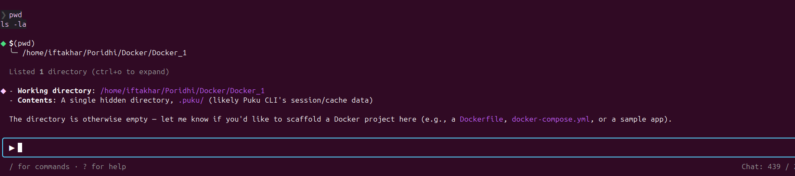</p>

Confirm the image is local:

```bash
docker images
```

<p align="center">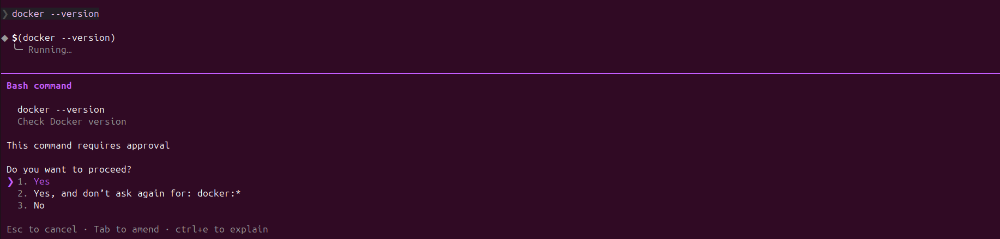</p>

---

## 4. Chapter 2 — Run with Volume Mount and Port Mapping

The default NGINX image serves only its built-in welcome page. To serve your own HTML and make it reachable from the host, you need two contracts: a **port mapping** and a **volume mount**.

<p align="center">
  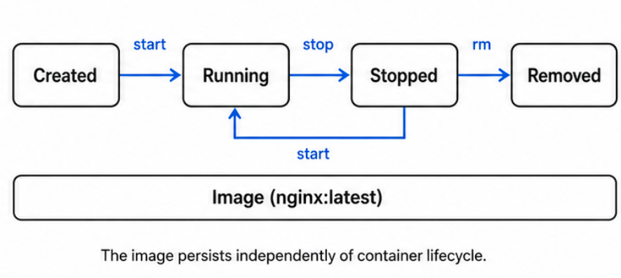
</p>

<p align="center">
  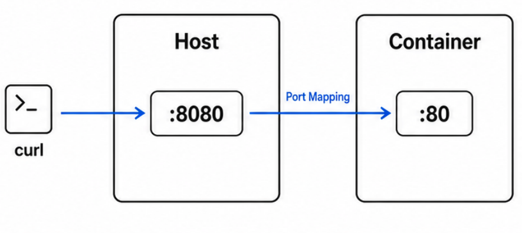
</p>

Create one HTML file:

```bash
echo '<h1>Hello from NGINX running in Docker!</h1>' > nginx-lab/html/index.html
```

<p align="center">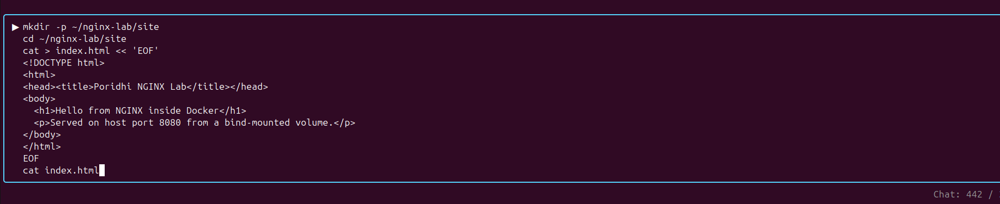</p>

Run the container:

```bash
docker run --name my-nginx \
  -v $(pwd)/nginx-lab/html:/usr/share/nginx/html:ro \
  -p 8080:80 \
  -d nginx
```

<p align="center"></p>

| Flag | What it does |
|---|---|
| `--name my-nginx` | Gives the container a stable name. Use it for stop, start, logs, rm. |
| `-v .../html:/usr/share/nginx/html:ro` | Mounts host folder into the container's web root, read-only. |
| `-p 8080:80` | Host port 8080 forwards to container port 80. Without this, the host cannot reach NGINX. |
| `-d` | Detached. Container runs in the background; the terminal stays free. |

Test from the terminal:

```bash
curl http://localhost:8080
```

<p align="center">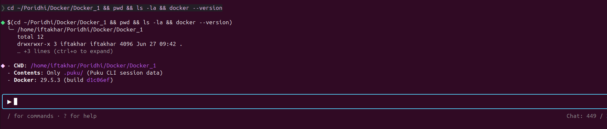</p>

Same result in the browser:

<p align="center"></p>

### Common mistake: forgetting `-p`

Without port mapping, the host cannot reach the container. Watch what happens:

<p align="center">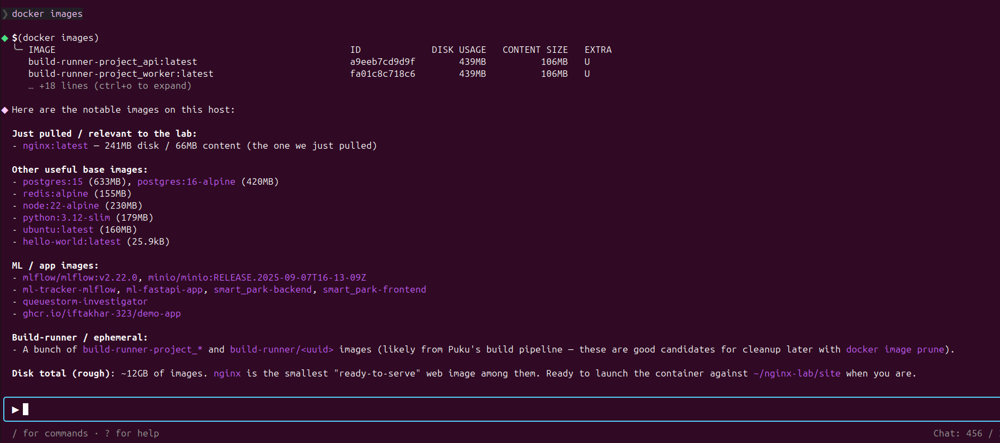</p>

---

## 5. Chapter 3 — Inspect the Container

A detached container prints nothing to your terminal. To see what it is doing, use `docker ps` for state and `docker logs` for activity.

**Status** is whether the process is alive. **Health** is whether the service is responding correctly. They are independent: a container can be `Up` but `unhealthy`.

<p align="center">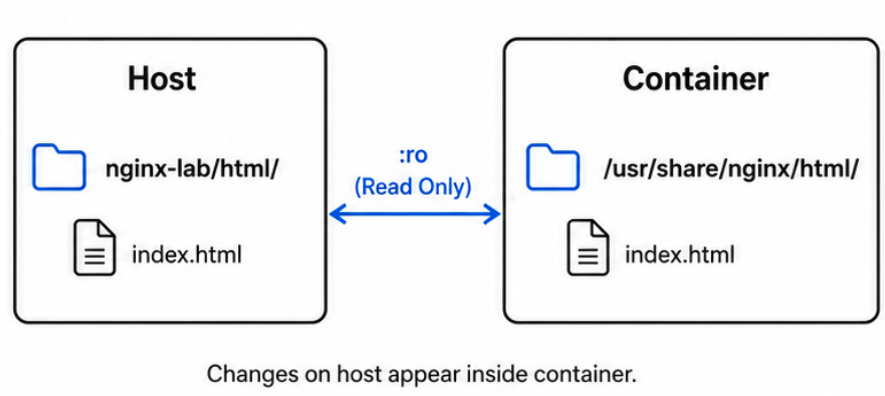</p>

List running containers:

```bash
docker ps
```

<p align="center">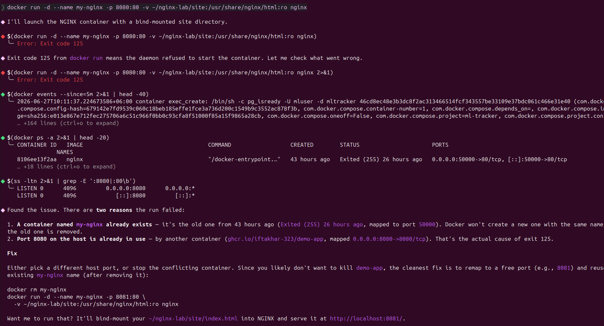80/tcp. This confirms the process is alive, the name is correct, and the port mapping is active."></p>

Read what NGINX is doing:

```bash
docker logs my-nginx
```

<p align="center">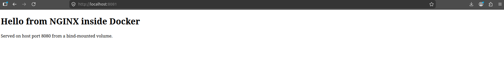</p>

Run `docker logs my-nginx` again after a few `curl` requests — new access entries appear at the bottom, one per request.

---

## 6. Chapter 4 — Container Lifecycle

Containers are temporary. Stop them, restart them, remove them as your app changes. The image is untouched by all of this.

<p align="center">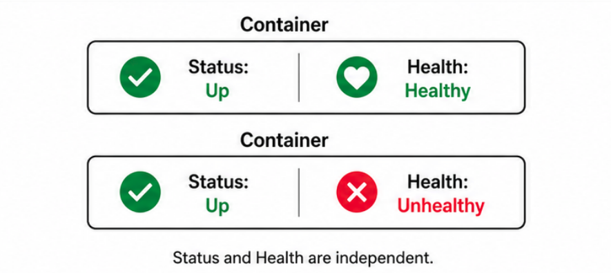</p>

Stop the container:

```bash
docker stop my-nginx
```

<p align="center">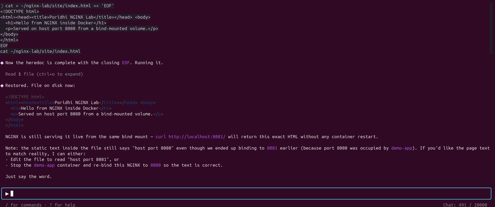</p>

Restart it:

```bash
docker start my-nginx
```

<p align="center"></p>

Remove it:

```bash
docker stop my-nginx
docker rm my-nginx
```

<p align="center">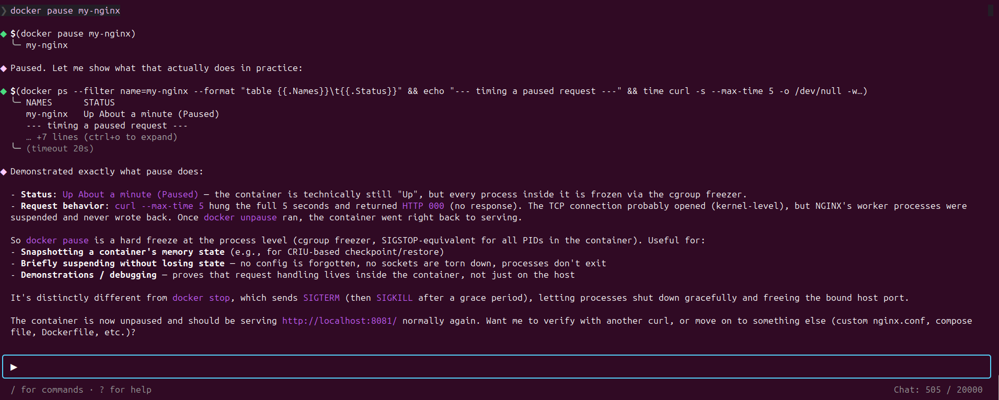</p>

<p align="center">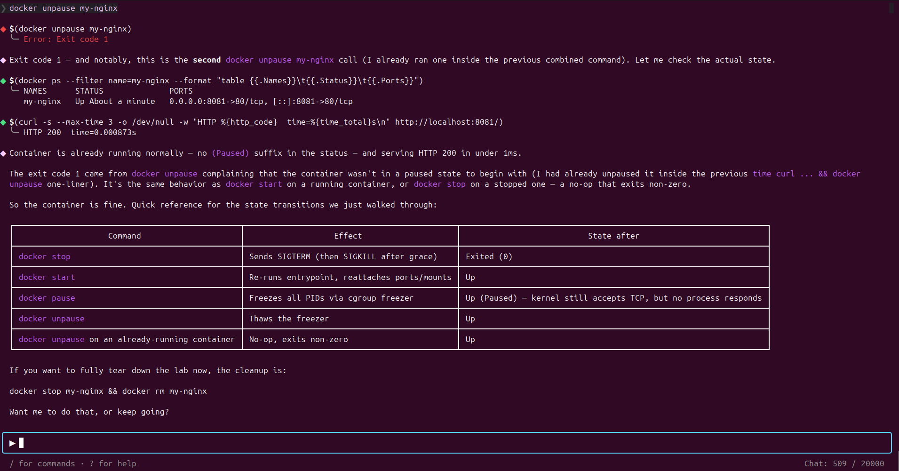</p>

### What happens if you try to start a removed container

```bash
docker start my-nginx
```

<p align="center">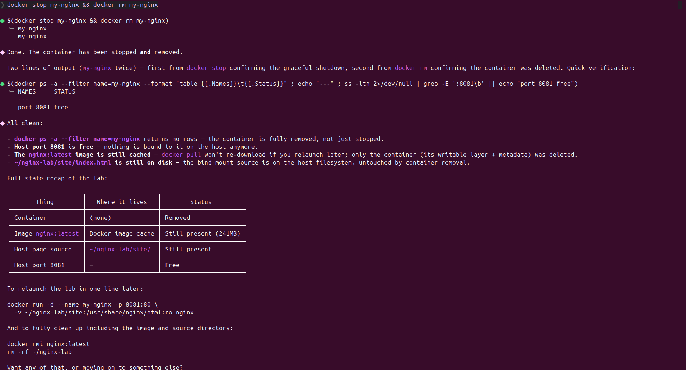</p>

---

## 7. Workflow Summary

```bash
docker pull nginx
mkdir -p nginx-lab/html
echo '<h1>Hello from NGINX running in Docker!</h1>' > nginx-lab/html/index.html

docker run --name my-nginx \
  -v $(pwd)/nginx-lab/html:/usr/share/nginx/html:ro \
  -p 8080:80 \
  -d nginx

curl http://localhost:8080
docker ps
docker logs my-nginx

docker stop my-nginx
docker start my-nginx
docker rm my-nginx
```

---

## 8. Key Principles

- **One image, many containers.** Stop and remove freely. The image persists.
- **Read-only mounts** protect your source files from the web server.
- **Explicit port mapping** is required for the host to reach the container.
- **Status** reports the process. **Health** reports the service. Both matter.
- **Content lives on the host.** Edits apply immediately, no rebuild needed.

---

## 9. Troubleshooting

| Symptom | Cause | Fix |
|---|---|---|
| `port is already allocated` | Another process holds the host port. | Pick a different port or free it: `lsof -ti:8080 \| xargs kill -9` |
| `Conflict. The container name "/my-nginx" is already in use` | A container with that name exists, possibly stopped. | `docker rm my-nginx` |
| `curl: (7) Connection refused` | Container not running, or `-p` missing. | Check `docker ps` and your `-p 8080:80`. |
| Permission denied writing to mounted volume | Mount has `:ro`. | Drop `:ro` if the app needs to write. |

---

## License

Released under the MIT License. See [`LICENSE`](LICENSE) for details.
