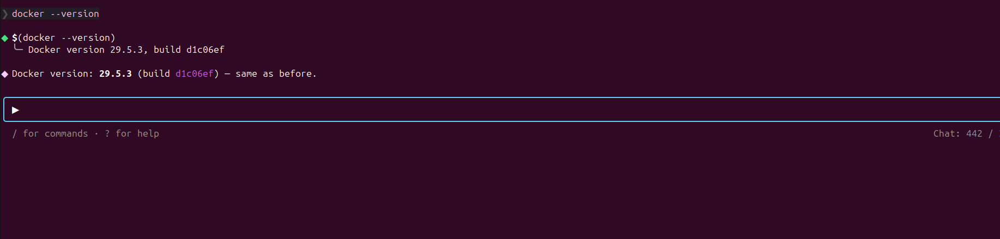
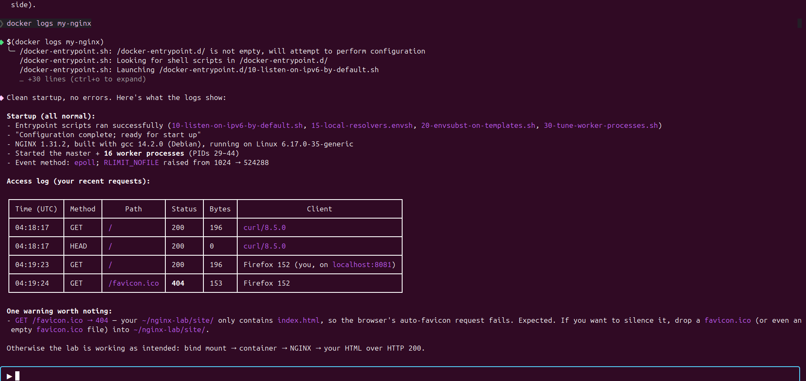

<div align="center">

# Containerized Web Serving with NGINX and Docker
### A Professional Hands-On Lab Manual

<p>
  
  
  
  
  
</p>

**A structured, image-driven lab for beginners and intermediate learners who want to deploy a reproducible NGINX web server using Docker.**

</div>

---

## Table of Contents

| # | Section | # | Section |
|---|---|---|---|
| 1 | [Title](#1-title) | 9 | [Final Challenge](#9-final-challenge) |
| 2 | [Introduction](#2-introduction) | 10 | [Epilogue](#10-epilogue) |
| 3 | [Learning Objectives](#3-learning-objectives) | 11 | [Key Principles](#11-key-principles) |
| 4 | [Prerequisites](#4-prerequisites) | 12 | [Troubleshooting](#12-troubleshooting) |
| 5 | [Prologue](#5-prologue) | 13 | [Best Practices](#13-best-practices) |
| 6 | [Environment Setup](#6-environment-setup) | 14 | [Next Steps](#14-next-steps) |
| 7 | [Chapters](#7-chapters) | 15 | [Additional Resources](#15-additional-resources) |
| 8 | [Mini Challenge](#8-mini-challenge) | | |

---

## 1. Title

**Containerized Web Serving with NGINX and Docker**

A professional, image-rich lab manual covering image pull, volume mounting, port mapping, container inspection, and full lifecycle management of NGINX inside Docker.

---

## 2. Introduction

### What This Lab Is About

Deploy NGINX in Docker end-to-end: pull the official image, mount a custom HTML directory, map host ports, manage the container lifecycle, and verify the running service.

### Why It Matters

Environment drift breaks production. Docker packages the app, its runtime, and its configuration into one immutable artifact that runs identically on any host.

### Where It Is Used in Industry

- Internal documentation portals and developer dashboards.
- Reverse proxies and load balancers in microservice architectures.
- Static site hosting in CI/CD pipelines.
- Local dev environments that mirror production.

### What You Will Build

A running NGINX container serving a custom HTML page at `http://localhost:8080`, content mounted from the project workspace, reproducible on any Docker-enabled machine.

### The End-to-End Dataflow

```
   ┌──────────────┐   docker pull    ┌──────────┐   docker run   ┌────────────┐
   │  Docker Hub  │ ───────────────▶ │  Local   │ ─────────────▶ │  Container │
   │  (registry)  │                  │  Image   │                │  (nginx)   │
   └──────────────┘                  └──────────┘                └─────┬──────┘
                                                                         │
                       Host :8080  ◀────  -p 8080:80  ──────────────────┤
                                                                         │
   ./nginx-lab/html/  ◀────  -v $(pwd)/nginx-lab/html:/usr/share/nginx/html:ro
                                                                         ▼
                                                                  curl / browser
```

<p align="center">
  
</p>

<p align="center"><sub><b>Figure 1.</b> The dataflow from registry → image → container → host port. Every chapter in this lab touches one of these arrows.</sub></p>

---

## 3. Learning Objectives

By the end of this lab, you will be able to:

- Create a reproducible containerized web server using an official Docker image.
- Configure port mapping between the host and a running container.
- Mount a host directory into a container as a read-only volume.
- Analyze container state using status, logs, and inspection commands.
- Debug a container that fails to respond on the expected port.
- Manage the full container lifecycle: run, stop, start, and remove.
- Distinguish container status from container health.

---

## 4. Prerequisites

### Required Knowledge

- Basic terminal usage (commands, navigation).
- HTTP and web server fundamentals.
- File paths and directory structures.

### Required Software

| Software | Minimum Version | Purpose |
|---|---|---|
| Docker Engine | 24.x | Container runtime. |
| Docker CLI | Bundled with Engine | Command-line interface. |
| curl | 7.x | HTTP testing from the terminal. |
| Operating system | Linux, macOS, or Windows with WSL2 | Host platform. |

### Recommended Editor: Puku CLI

This lab is authored inside **Puku CLI** — an AI-native, terminal-first code editor combining a file explorer, syntax-aware editor, integrated terminal, and AI coding assistant.

**Workflow inside Puku:**

- Open `docker/` as the workspace root.
- Run every `docker` command in the integrated terminal; Puku preserves the working directory and environment variables across runs.
- Use the file explorer to inspect `image/` (screenshots) and to edit `nginx-lab/html/index.html` and any challenge files.
- Preview rendered Markdown of this README in the editor.
- `.puku/` is editor-private and is already excluded via `.gitignore`.

---

## 5. Prologue

### Scenario

You have joined a platform team that maintains internal documentation portals. A colleague built one of these portals locally and it works on their laptop. On a shared staging server, the service fails: missing system libraries, wrong NGINX version, port already bound by another service.

The infrastructure lead assigns:

> Containerize the web server so the environment is reproducible anywhere. Use NGINX in Docker.

### Your Role

Deliver a reproducible web server: select an official base image, define how content is mounted, expose the service on a stable host port, and document the workflow so the rest of the team can repeat it.

### Expected Outcome

An NGINX container serving custom HTML on host port 8080, with its content directory mounted from the project workspace. The configuration must work identically when re-run on any Docker-enabled machine.

---

## 6. Environment Setup

### Step 1 — Verify Docker

```bash
docker --version
```

Expected output:

```text
Docker version 24.x.x, build xxxxxxx
```

If Docker is not installed, follow the official guide: <https://docs.docker.com/engine/install/>.

<p align="center"></p>

### Step 2 — Verify curl

```bash
curl --version
```

Expected output begins with `curl 7.x.x`.

### Step 3 — Create the Project Structure

```bash
mkdir -p nginx-lab/html
```

### Step 4 — Confirm the Project Layout

```text
docker/
├── image/                 # Lab screenshots
├── nginx-lab/
│   └── html/              # Content directory (mount target)
└── README.md              # This lab manual
```

---

## 7. Chapters

---

### Chapter 1: Images and the Docker Hub Registry

#### Overview

Images are immutable templates; containers are running instances created from images. Before you can run anything, the image must be on your local machine.

#### What You Will Build

The official `nginx` image, downloaded from Docker Hub and verified locally.

#### Think First

Statement A: "The NGINX image is running." Statement B: "The NGINX container is running." Which is accurate, and what is the difference between an image and a container?

<details><summary><b>Show Answer</b></summary>

Only a container can run. An image is a read-only template — a snapshot of a filesystem and configuration. A container is a running instance created from that image. One image can produce many containers simultaneously, each isolated from the others.

The accurate statement is **B**.
</details>

#### Step 1 — Pull the Image

```bash
docker pull nginx
```

<p align="center"></p>

Docker downloads each layer in parallel and confirms each as it completes.

#### Step 2 — Verify the Image

```bash
docker images
```

<p align="center"></p>

<p align="center"></p>

#### Understanding

The `docker pull` command performs two actions:

1. It contacts Docker Hub and resolves the image name `nginx` to a specific image digest.
2. It downloads only the layers not already present on the local machine, then assembles them into a single image.

#### Test and Verify

Predict: which columns will `docker images` display?

<details><summary><b>Show Answer</b></summary>

The columns are `REPOSITORY`, `TAG`, `IMAGE ID`, `CREATED`, and `SIZE`. The `nginx` image with tag `latest` appears in the list.

```text
REPOSITORY   TAG       IMAGE ID       CREATED       SIZE
nginx        latest    ec4ed8b5299e   2 weeks ago   241MB
```
</details>

#### Checkpoint

- [ ] `docker pull nginx` completed without errors.
- [ ] `docker images` lists `nginx` with the `latest` tag.
- [ ] You can explain the difference between an image and a container in one sentence.

---

### Chapter 2: Serving Content with Volume Mounts

#### Overview

A container started from the default `nginx` image serves only its built-in welcome page. To serve custom content, mount a host directory into the container's web root, map a host port, and run detached.

<p align="center">
  
  &nbsp;&nbsp;&nbsp;&nbsp;
  
</p>

<p align="center"><sub><b>Figure 2.</b> The two contracts that make a container reachable and useful: port mapping (left) and volume mount (right).</sub></p>

#### What You Will Build

A custom HTML page served by NGINX via a volume mount and port mapping, reachable at `http://localhost:8080`.

#### Think First

NGINX inside the container listens on port 80. Your host cannot directly reach port 80 inside a running container. What does the `-p 8080:80` flag do, and which number is the host port?

<details><summary><b>Show Answer</b></summary>

The `-p` flag maps a host port to a container port. The format is `host_port:container_port`. `-p 8080:80` means requests arriving at port 8080 on the host are forwarded to port 80 inside the container. The first number (`8080`) is the host port. Without this mapping, the container's network is isolated and unreachable from outside.
</details>

#### Step 1 — Create the HTML Page

```bash
echo '<h1>Hello from NGINX running in Docker!</h1>' > nginx-lab/html/index.html
```

<p align="center"></p>

#### Step 2 — Run the Container

Fill in the blanks:

```bash
docker run --name my-nginx \
  -v $(pwd)/nginx-lab/html:/usr/share/nginx/html:___ \   # Blank 1: read-only mode
  -p ___:80 \                                            # Blank 2: host port
  -_ nginx                                               # Blank 3: detached flag
```

Hints: Blank 1 = two-letter "read-only" abbreviation; Blank 2 = port `8080`; Blank 3 = single-letter flag.

<details><summary><b>Show Solution</b></summary>

```bash
docker run --name my-nginx \
  -v $(pwd)/nginx-lab/html:/usr/share/nginx/html:ro \
  -p 8080:80 \
  -d nginx
```

| Flag | Purpose |
|---|---|
| `--name my-nginx` | Assigns a stable, human-readable container name. |
| `-v .../html:/usr/share/nginx/html:ro` | Mounts the local directory read-only into the web root. |
| `-p 8080:80` | Maps host port 8080 to container port 80. |
| `-d` | Runs detached (in the background). |

On Windows PowerShell, replace `$(pwd)` with `${PWD}`.
</details>

<p align="center"></p>

#### Understanding — What Each Flag Does

| Flag | Contract |
|---|---|
| `--name` | Makes the container addressable by a stable string. |
| `-v` | Binds a host directory to a directory inside the container. `:ro` blocks writes from inside. |
| `-p` | Declares the network bridge between host and container. Always `host:container`. |
| `-d` | Detaches the container from the terminal. |

#### Step 3 — Test from the Terminal

```bash
curl http://localhost:8080
```

<p align="center"></p>

#### Step 4 — Test from the Browser

<p align="center"></p>

#### Experiment — Remove the Port Mapping

```bash
docker stop my-nginx
docker rm my-nginx
docker run --name my-nginx -v $(pwd)/nginx-lab/html:/usr/share/nginx/html:ro -d nginx
curl http://localhost:8080
```

<p align="center"></p>

What happens, and why?

<details><summary><b>Show Answer</b></summary>

The request fails with `Connection refused`. Without `-p`, the container's port 80 is not reachable from the host. The container's network namespace is isolated by default.

Restore the correct setup before continuing:

```bash
docker stop my-nginx
docker rm my-nginx
```
</details>

#### Matching Exercise

| Flag | Purpose |
|---|---|
| `--name my-nginx` | A. Run detached. |
| `-v ...:ro` | B. Map host port to container port. |
| `-p 8080:80` | C. Mount a host directory read-only. |
| `-d` | D. Assign a name to the container. |

<details><summary><b>Show Answer</b></summary>

- `--name my-nginx` → D
- `-v ...:ro` → C
- `-p 8080:80` → B
- `-d` → A
</details>

#### Checkpoint

- [ ] Container started without errors and returned a container ID.
- [ ] `curl http://localhost:8080` returns your custom HTML.
- [ ] You can explain what `:ro` prevents and why it matters.
- [ ] You can predict what happens if `-p 8080:80` is omitted.

---

### Chapter 3: Inspecting a Running Container

#### Overview

A container running in detached mode produces no terminal output. To verify its state and diagnose issues without restarting it, Docker provides commands to inspect status, examine logs, and confirm network configuration.

<p align="center">
  
</p>

<p align="center"><sub><b>Figure 3.</b> Status reports the process state; health reports the service state. Both must be checked for production.</sub></p>

#### What You Will Build

Inspection of the running `my-nginx` container, its access logs, and proof of live log updates as requests arrive.

#### Think First

A teammate tells you a container shows status `Up 2 minutes (unhealthy)`. What does this indicate, and how does it differ from `Up 2 minutes`?

<details><summary><b>Show Answer</b></summary>

`Up 2 minutes` means the container process is running. `Up 2 minutes (unhealthy)` means the process is running, but a configured health check is failing. The process has not crashed, but the service inside it is not passing its own readiness tests. In production, a load balancer should route traffic only to healthy containers.
</details>

#### Step 1 — List Running Containers

```bash
docker ps
```

<p align="center"></p>

<p align="center"></p>

Expected columns: `CONTAINER ID`, `IMAGE`, `COMMAND`, `CREATED`, `STATUS`, `PORTS`, `NAMES`.

#### Step 2 — Read the Container Logs

```bash
docker logs my-nginx
```

<p align="center"></p>

<p align="center"></p>

#### Understanding

| Command | Question it answers |
|---|---|
| `docker ps` | Is the container process alive? What ports are bound? |
| `docker logs` | What is the container actually doing? |
| `docker inspect` | Full structured configuration as JSON. |

NGINX writes three categories of information to its logs:

1. Entrypoint configuration messages during startup.
2. Worker process notifications from the NGINX master.
3. Access log entries for every HTTP request, and error log entries for failed requests.

#### Experiment — Observing Live Log Updates

```bash
docker logs my-nginx     # baseline
curl http://localhost:8080
curl http://localhost:8080
curl http://localhost:8080
docker logs my-nginx     # 3 new entries
```

<p align="center"></p>

<p align="center"></p>

<p align="center"></p>

<details><summary><b>Show Answer</b></summary>

Three new access entries appear, one per `curl` request. Each entry records the client IP, timestamp, HTTP method, path, and status code. A `404` for `/favicon.ico` is normal — browsers request it automatically.
</details>

#### Checkpoint

- [ ] `docker ps` shows `my-nginx` with status `Up`.
- [ ] `docker logs my-nginx` shows startup and access entries.
- [ ] You can identify the HTTP method, path, and status code in a log line.
- [ ] You can explain the difference between container status and container health.

---

### Chapter 4: Container Lifecycle Management

#### Overview

Containers are ephemeral by design. A deployment workflow involves starting, stopping, restarting, and eventually removing containers as application versions change. These operations leave the underlying image intact, which means a removed container can be replaced by creating a new one from the same image.

<p align="center">
  
</p>

<p align="center"><sub><b>Figure 4.</b> The container state machine. Each transition in this diagram is a Docker CLI command you will execute in this chapter.</sub></p>

#### What You Will Build

You will stop, restart, and remove the `my-nginx` container, observe the state transitions at each step, and confirm that the underlying image is unaffected.

#### Think First

After `docker stop my-nginx`, can you run `docker start my-nginx`? After `docker rm my-nginx`, can you run `docker start my-nginx`?

<details><summary><b>Show Answer</b></summary>

`docker stop` halts the container process but preserves the container record. `docker start` can restart it. `docker rm` deletes the container record entirely. `docker start` fails because the named container no longer exists. The image (`nginx:latest`) is not affected by either operation.
</details>

#### Step 1 — Stop the Container

```bash
docker stop my-nginx
```

<p align="center"></p>

Predict: will `my-nginx` appear in `docker ps` output?

<details><summary><b>Show Answer</b></summary>

No. `docker ps` shows only running containers. To see all containers including stopped ones:

```bash
docker ps -a
```

<p align="center"></p>

```text
CONTAINER ID   IMAGE   COMMAND            CREATED         STATUS                     NAMES
8106ee13f2aa   nginx   "/docker-entry…"   10 minutes ago  Exited (0) 30 seconds ago  my-nginx
```
</details>

#### Step 2 — Restart the Container

```bash
docker start my-nginx
curl http://localhost:8080
```

<p align="center"></p>

<p align="center"></p>

<details><summary><b>Expected output</b></summary>

```html
<h1>Hello from NGINX running in Docker!</h1>
```
</details>

#### Step 3 — Stop and Remove the Container

```bash
docker stop my-nginx
docker rm my-nginx
```

<p align="center"></p>

#### Step 4 — Verify the Image Remains

```bash
docker images
```

<p align="center"></p>

<details><summary><b>Expected output</b></summary>

```text
REPOSITORY   TAG       IMAGE ID       CREATED       SIZE
nginx        latest    ec4ed8b5299e   2 weeks ago   241MB
```
</details>

#### Experiment — Start a Removed Container

```bash
docker start my-nginx
```

<p align="center"></p>

What error do you see, and what does it tell you?

<details><summary><b>Show Answer</b></summary>

```text
Error response from daemon: No such container: my-nginx
```

The container record no longer exists. `docker start` cannot recreate it. To run NGINX again, you must use `docker run` to create a new container from the image. This demonstrates that `docker rm` is irreversible and that images — not containers — are the durable artifact.
</details>

#### Checkpoint

- [ ] `docker stop` halted the container; it no longer appears in `docker ps`.
- [ ] `docker start` restarted it; the web page was accessible again.
- [ ] `docker rm` removed the container but the image remains in `docker images`.
- [ ] You can explain when `docker ps` versus `docker ps -a` is appropriate.

---

## 8. Mini Challenge

**Objective:** Serve a multi-page HTML site from the same NGINX container without rebuilding it.

**Requirements:**

1. Create two additional files inside `nginx-lab/html/`:
   - `about.html` containing `<h2>About</h2>` and one paragraph.
   - `contact.html` containing `<h2>Contact</h2>` and one paragraph.
2. Start a new NGINX container named `my-nginx-multi` with:
   - The same volume mount as Chapter 2.
   - A different host port: `8081`.
3. Verify each page is reachable:
   - `http://localhost:8081/` → `index.html`
   - `http://localhost:8081/about.html` → `about.html`
   - `http://localhost:8081/contact.html` → `contact.html`
4. Stop and remove the container when finished.

**Acceptance Criteria:**

- All three URLs return their respective HTML files without restarting the container after adding new files.
- The volume mount must remain read-only.
- No solution is provided. Refer to Chapter 2 for the relevant flags.

---

## 9. Final Challenge

**Objective:** Deploy a custom NGINX configuration that serves a styled 404 page for any unknown path, while preserving the existing content mount.

**Background:** A production web server must respond predictably when users request paths that do not exist. Instead of returning a bare 404, the server should return a styled HTML page that maintains brand consistency.

**Requirements:**

1. Create `nginx-lab/custom-404.html` containing a friendly 404 message.
2. Create `nginx-lab/nginx.conf` with:
   - A `server` block listening on port 80.
   - `root /usr/share/nginx/html;`
   - `error_page 404 /custom-404.html;`
   - `location = /custom-404.html { internal; }` to prevent direct access to the 404 page.
3. Run a new NGINX container that mounts (all read-only):
   - `nginx-lab/html` → `/usr/share/nginx/html`
   - `nginx-lab/nginx.conf` → `/etc/nginx/conf.d/default.conf`
   - `nginx-lab/custom-404.html` → `/usr/share/nginx/html/custom-404.html`
   - Host `8082` → container `80`
4. Verify:
   - `curl http://localhost:8082/` returns `index.html`.
   - `curl http://localhost:8082/missing` returns `custom-404.html` with HTTP 404.

**Acceptance Criteria:**

- The custom 404 page is returned for any unknown path.
- The configuration file is mounted from the host, not baked into the image.
- All volume mounts are read-only.

---

## 10. Epilogue

### Architecture Summary

The final system consists of four components working together:

1. The official `nginx:latest` image, sourced from Docker Hub.
2. A host directory `nginx-lab/html/` that holds the website's source content.
3. A Docker volume mount that exposes the host directory at `/usr/share/nginx/html` inside the container, in read-only mode.
4. A Docker port mapping that forwards host port 8080 to container port 80.

### Feature Summary

- A running NGINX container named `my-nginx` serving custom HTML content.
- Read-only content mount ensuring the web server cannot modify source files.
- Stable host-to-container port mapping allowing external access.
- Reproducible setup that runs identically on any Docker-enabled machine.

### Workflow Summary

1. Pull the official image: `docker pull nginx`.
2. Prepare the content directory: `mkdir -p nginx-lab/html` and add HTML files.
3. Run the container with volume mount, port mapping, and detached mode: `docker run --name my-nginx -v ... -p 8080:80 -d nginx`.
4. Verify the service: `curl http://localhost:8080`.
5. Inspect runtime state: `docker ps` and `docker logs my-nginx`.
6. Manage the lifecycle: `docker stop`, `docker start`, `docker rm`.

---

## 11. Key Principles

- **Validate at system boundaries.** Host port, container port, and volume mount are explicit contracts between host and container.
- **Fail fast on missing inputs.** A wrong path in `-v` or a duplicate container name produces immediate, clear errors.
- **Design for observability.** Status, logs, and port mappings each reveal a different aspect of container behavior.
- **Reuse resources.** One image produces many containers. Stop and remove containers freely; the image persists.
- **Prefer explicit behavior over defaults.** Read-only mounts, named containers, and explicit port mappings remove ambiguity.
- **Separate content from infrastructure.** The HTML directory lives on the host. Updates apply immediately, without rebuilding the container.

---

## 12. Troubleshooting

### Error: `port is already allocated`

| | |
|---|---|
| **Cause** | Another process is using the specified host port. |
| **Solution** | Choose a different host port, or free the port: `lsof -ti:8080 \| xargs kill -9` |

### Error: `Conflict. The container name "/my-nginx" is already in use`

| | |
|---|---|
| **Cause** | A container named `my-nginx` already exists (possibly stopped). |
| **Solution** | `docker rm my-nginx` |

### Error: `curl: (7) Failed to connect to localhost port 8080: Connection refused`

| | |
|---|---|
| **Cause** | The container is not running, or the port mapping does not match. |
| **Solution** | Inspect state: `docker ps`, `docker inspect my-nginx \| grep -A5 Mounts` |

### Error: `bind: address already in use`

| | |
|---|---|
| **Cause** | Another container or host service is bound to the same host port. |
| **Solution** | Identify and stop the conflicting process, or select a different host port. |

### Error: Permission denied writing to a mounted volume

| | |
|---|---|
| **Cause** | The mount is read-only (`:ro`) or the host directory has restrictive permissions. |
| **Solution** | Use `:ro` only when the application does not need write access. Otherwise, ensure the host directory is writable by the UID running inside the container. |

---

## 13. Best Practices

- **Pin image versions in production.** Use `nginx:1.27` instead of `nginx:latest` to ensure reproducible deployments.
- **Use named containers.** The `--name` flag makes logs, stop, and rm operations unambiguous.
- **Prefer read-only mounts for content directories.** Web servers do not need to modify HTML at runtime.
- **Set a restart policy.** Use `--restart unless-stopped` for services that must recover from host reboots.
- **Centralize configuration.** Mount custom `nginx.conf` from the host instead of forking images for every change.
- **Keep images lean.** Use the official `nginx:alpine` variant for smaller image size when the full Debian-based image is not required.
- **Avoid running as root in production.** Add a non-root user to a derived image when security requirements demand it.
- **Log to stdout.** The official NGINX image is already configured to write logs to stdout and stderr, integrating with `docker logs`.

---

## 14. Next Steps

1. Build a custom image with a Dockerfile that bakes HTML at build time rather than via a runtime mount.
2. Compose multiple services using Docker Compose — for example, NGINX in front of a backend application.
3. Add a health check directive in a custom `nginx.conf` so Docker can report container health, not just process status.
4. Provision TLS certificates using a reverse proxy with Let's Encrypt.
5. Move from bind mounts to named Docker volumes for stateful data and shared storage across containers.
6. Explore container orchestration with Kubernetes for multi-host deployments.

---

## 15. Additional Resources

- Docker CLI Reference — <https://docs.docker.com/reference/cli/docker/>
- Official NGINX Docker Image — <https://hub.docker.com/_/nginx>
- Docker Volume Documentation — <https://docs.docker.com/storage/volumes/>
- Docker Networking Overview — <https://docs.docker.com/network/>
- NGINX Configuration Documentation — <https://nginx.org/en/docs/>

---

## License

This lab manual is released under the MIT License. See [`LICENSE`](LICENSE) for details.
